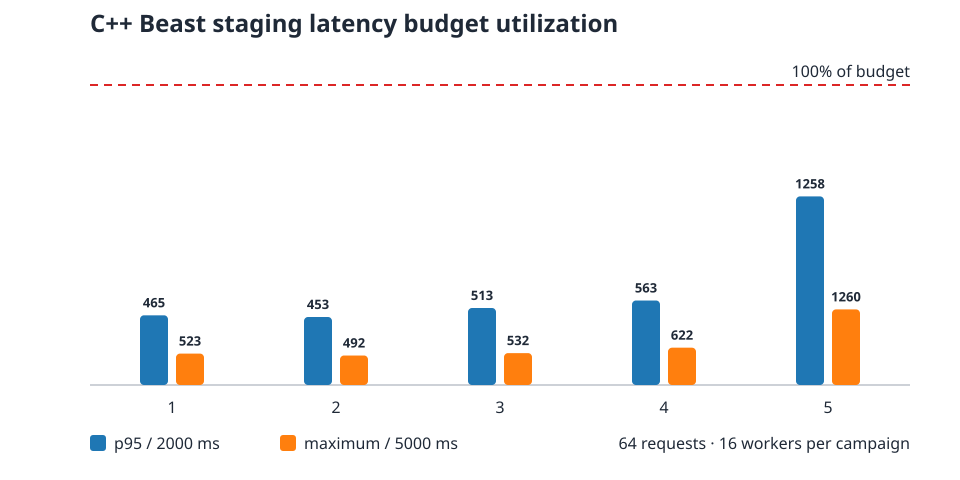

# C++ Beast reference qualification

**Verdict: PASS** for commit `7500baa49debd6ab47b8591b7af92fa1b31f49f4` on the recorded staging path.

The gate built the native Boost.Beast server, verified idle shutdown, reused one external HTTP keep-alive connection across two requests, completed 5 campaigns of 64 requests with 16 workers, and cancelled a deliberately incomplete HTTP read during `SIGINT`. Every response was byte-exact and every process exited without a runtime error.

| Campaign | p95 (ms) | maximum (ms) | mean (ms) |
| ---: | ---: | ---: | ---: |
| 1 | 464.8 | 523.0 | 411.8 |
| 2 | 453.3 | 492.1 | 416.2 |
| 3 | 513.4 | 531.8 | 428.5 |
| 4 | 563.4 | 621.7 | 445.5 |
| 5 | 1257.5 | 1260.2 | 626.5 |

Across all 320 measured requests, p95 was 765.9 ms, maximum was 1260.2 ms, and mean was 465.7 ms. The remote-staging gates are p95 ≤ 2000 ms and maximum ≤ 5000 ms.

The chart expresses each measurement as utilization of its own budget so p95 and maximum remain visually comparable; bar labels are the measured milliseconds. This is reproducible regression evidence for this commit and network path, not a universal public SLO. The wide budgets are designed to detect serialization, stalled handshakes, and cancellation failures while tolerating normal WAN variance.

Machine-readable inputs, hashes, individual campaign values, and thresholds are in [`manifest.json`](manifest.json).
