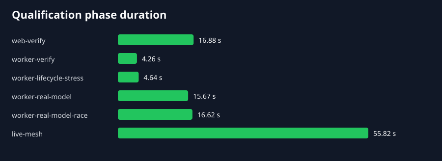
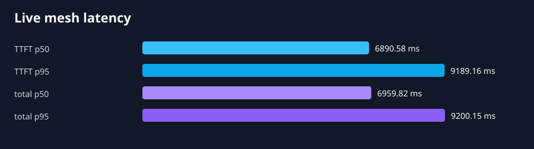
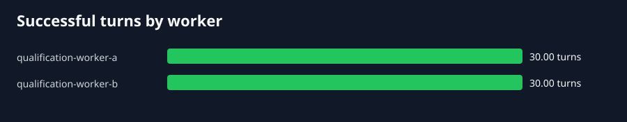

# Private LLM mesh qualification — revision d7a9dc4

**Verdict: PASS**

Scope: local code/model plus live mesh.
Revision: `d7a9dc47ee3474ed4594dbd818e758ed7e02e7a1` (clean worktree).
Model: `Qwen_Qwen3-4B-Instruct-2507-Q4_K_M.gguf` · 2497280736 bytes · SHA-256 `2fde00ce69dd4899c70d020845e2638353015bba0fdf161b3eb965f2bca4464e`.

## Automated gates

| Phase | Result | Wall time |
| --- | --- | ---: |
| web-verify | PASS | 16.877 s |
| worker-verify | PASS | 4.258 s |
| worker-lifecycle-stress | PASS | 4.636 s |
| worker-real-model | PASS | 15.666 s |
| worker-real-model-race | PASS | 16.618 s |
| live-mesh | PASS | 55.818 s |

## Live mesh

60/60 turns succeeded across 2 workers at 1.08 turns/s.

| Signal | p50 | p95 |
| --- | ---: | ---: |
| Time to first token/output | 6890.6 ms | 9189.2 ms |
| Total turn | 6959.8 ms | 9200.2 ms |

Both workers served the same Qwen3 4B model with one decoding context. The
application distributed the concurrent turns exactly 30/30. Every response was
validated as a complete UI stream with worker attribution, text or tool output,
the final protocol marker, and no error part. Requests crossed the Next.js chat
route, scoped-token minting, rstream edge, worker tunnel, and llama.cpp engine.

The latency values describe this deliberately capacity-constrained qualification
host; they are not a general CPU, GPU, or cloud performance claim. The worker
distribution and stream-integrity assertions are the portable result.

## Degraded operation and recovery

After one of the two controlled workers stopped, the degraded check completed
20/20 turns on the surviving worker with no failed stream. Once the worker
returned and advertised the model again, the recovery check completed another
20/20 turns and restored an exact 10/10 split. The aggregate driver outputs are
retained as [`degraded.json`](degraded.json) and
[`recovery.json`](recovery.json).

These two supplemental runs used an operator-controlled worker lifecycle. They
qualify the observed degraded and recovery sequence; the 60-turn live driver
and the code-level pre-start failover assertions remain fully automated.

## Integrity and interpretation

Credential-shaped findings: **0**. Any finding fails the run and is redacted in
place. The scheduler tests cover eligibility, capacity-normalized distribution,
concurrent reservation, stale reservation cleanup, and idempotent release.
Real-model tests cover text/tool semantics, concurrency, bounded saturation,
cancellation, and shutdown ordering. The manifest and session JSON retain the
exact revision, model hash, tools, parameters, thresholds, and command verdicts.
