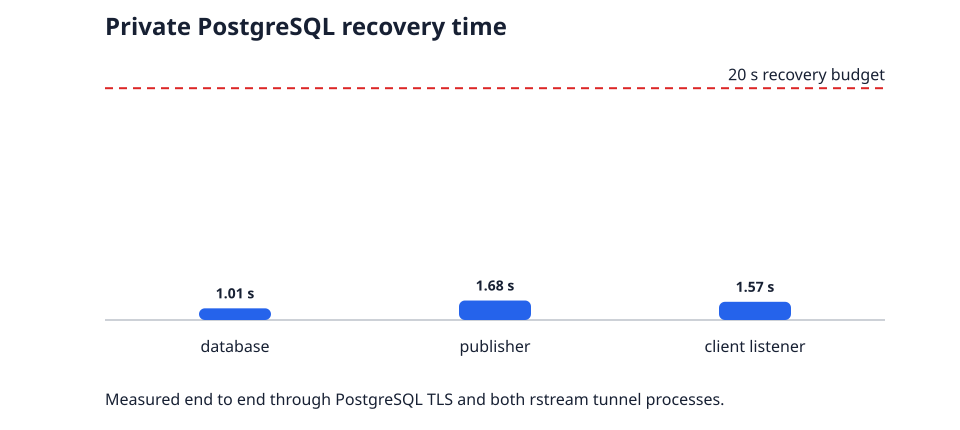

# Private PostgreSQL qualification — PASS

Revision `f2eefd162ba0308a5309ff171fe58dceff1088b8` was exercised through a private rstream tunnel with PostgreSQL TLS enabled.

The run verified exact rollback and commit behavior, copied 10,000 deterministic rows (5,120,000 bytes), cancelled a long query, and restored service after independent PostgreSQL, publishing-tunnel, and client-listener interruptions.

## Concurrent workload

Eight clients completed 160 transactions through the private tunnel. Average latency was 110.92 ms, p95 was 123.01 ms, maximum was 382.40 ms, and throughput was 72.12 transactions/s.

## Recovery

| Interrupted component | End-to-end recovery | Budget |
| --- | ---: | ---: |
| database | 1.01 s | 20 s |
| publisher | 1.68 s | 20 s |
| client listener | 1.57 s | 20 s |

## Automated verdict

- **PASS** — `postgres-tls`: PostgreSQL reports TLS for the tunneled session
- **PASS** — `transaction-rollback`: rollback leaves no row
- **PASS** — `transaction-commit`: commit leaves exactly one row
- **PASS** — `bulk-copy`: bulk row count, bytes, and digest match
- **PASS** — `bulk-throughput`: verified bulk copy sustains at least 250 kB/s
- **PASS** — `concurrent-throughput`: pgbench throughput is at least 20 transactions/s
- **PASS** — `concurrent-latency`: pgbench average latency is at most 500 ms
- **PASS** — `concurrent-tail-latency`: pgbench p95 is at most 750 ms and maximum is at most 2000 ms
- **PASS** — `query-cancellation`: long query cancellation completes within 5 s
- **PASS** — `database-recovery`: database recovers within 20 s
- **PASS** — `publisher-recovery`: publisher recovers within 20 s
- **PASS** — `client listener-recovery`: client listener recovers within 20 s

The result qualifies this recorded revision and environment. It is a regression gate for PostgreSQL semantics and tunnel recovery, not a database capacity forecast.
