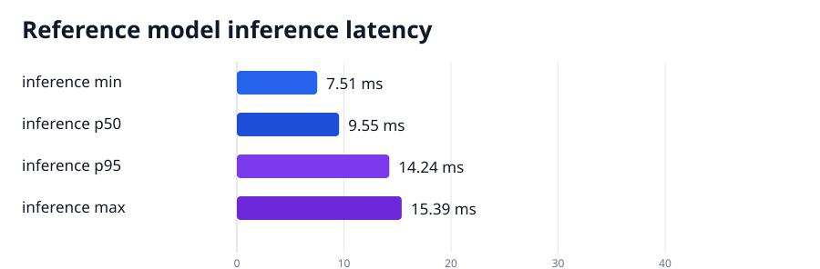
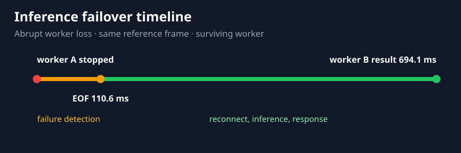
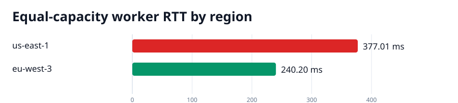

# Distributed Vision qualification report

**Verdict: PASS — configured functional and performance gates**

Scope: local protocol, lifecycle, real model, and reference media, plus deployed rstream mesh transit and failure handling.
Revision: `34aa947b7139fe58e6b9a4ea32dfb5100b61318e` (clean worktree).
Model: `yolov8n.pt` · SHA-256 `f59b3d833e2ff32e194b5bb8e08d211dc7c5bdf144b90d2c8412c47ccfc83b36`.
Media: `highway-traffic-pexels-2103099.mp4` · SHA-256 `9e18115c6dd7ec9fb41734d497c71effaa4f6184e7df5acaca4185a4f72f6794`.

Performance gates: model p95 <= 40.0 ms; model throughput >= 25.0 fps; live RTT p95 <= 750.0 ms; failover <= 2500.0 ms; reference-payload transport overhead p95 <= 750.0 ms.

## Method

The local profile pins the YOLO model and reference media, exercises framing and malformed results, runs cancellation and lifecycle stress, then benchmarks the exact model input. The live profile starts two managed workers, fills and releases their bounded session capacity, kills the worker that owns an open stream, waits for the transport failure signal, reconnects to the surviving worker, and requires an identical canonical signature covering labels, confidence scores, and bounding boxes. Regional and payload-size probes run as separate gates so routing decisions and transport scaling cannot be hidden inside an aggregate latency.

## Acceptance gates

- The complete code, protocol, cancellation, and lifecycle suite must pass.
- Capacity exhaustion must reject the excess session explicitly and accept a new session after release.
- Worker loss must be observed on the existing stream, and failover must return identical detections from the surviving worker.
- Framed transport must preserve every byte at every tested payload size.
- Equal-capacity regional selection must choose the lower measured session-establishment latency.
- Every configured model, live-path, failover, and transport performance budget must pass.

## Code and lifecycle gates

| Phase | Result | Wall time | Raw log |
| --- | --- | ---: | --- |
| sample-verify | PASS | 12.491 s | [sample-verify.log](sample-verify.log) |
| qualification-tests | PASS | 1.292 s | [qualification-tests.log](qualification-tests.log) |
| worker-cancellation-stress | PASS | 15.310 s | [worker-cancellation-stress.log](worker-cancellation-stress.log) |
| worker-real-model | PASS | 2.697 s | [worker-real-model.log](worker-real-model.log) |
| model-benchmark | PASS | 4.276 s | [model-benchmark.log](model-benchmark.log) |
| live-mesh | PASS | 13.483 s | [live-mesh.log](live-mesh.log) |
| transport-profile | PASS | 38.826 s | [transport-profile.log](transport-profile.log) |
| regional-routing | PASS | 25.377 s | [regional-routing.log](regional-routing.log) |

## Model and media baseline

Accelerator: **Apple M1 Max** (`mps`). Reference payload: 36083 bytes.

| Signal | Result |
| --- | ---: |
| Detections on reference frame | 15 |
| Inference p50 | 9.55 ms |
| Inference p95 | 14.24 ms |
| Sequential throughput | 47.21 fps |
| Serialized concurrent throughput | 50.82 fps |

## Live mesh and failure handling

Workers registered in: `eu-west-3`. Reference payload: 36083 bytes.

| Signal | Result |
| --- | ---: |
| Frames checked | 62 |
| Loopback p95 | 29.68 ms |
| rstream p50 | 164.21 ms |
| rstream p95 | 430.34 ms |
| Capacity rejection | 287.88 ms |
| Capacity recovery | 356.14 ms |
| Abrupt failure detection | 110.64 ms |
| End-to-end failover | 694.13 ms |

The failover clock starts immediately before the harness kills worker A. The first marker is the EOF observed on its existing stream; the final marker is a byte-valid inference response from worker B. Inventory removal is measured separately and is not on the request recovery critical path.

## Transport scaling

The framed echo verifies byte equality and shows how payload size changes round-trip latency on the same path. Byte integrity is a verdict gate at every size; these scaling latencies are observational. The configured transport budget applies to the reference inference payload reported above.

| Payload | Loopback p95 | rstream p50 | rstream p95 |
| ---: | ---: | ---: | ---: |
| 1024 B | 0.15 ms | 98.51 ms | 116.51 ms |
| 8192 B | 0.15 ms | 111.55 ms | 134.00 ms |
| 36083 B | 0.18 ms | 144.66 ms | 177.29 ms |
| 131072 B | 0.20 ms | 235.04 ms | 370.09 ms |
| 524288 B | 0.45 ms | 581.54 ms | 891.80 ms |

## Regional worker selection

Both candidates reported equal capacity. The legacy order would have selected `vision-route-22ce37f8-remote`; the measured tie-break selected `vision-route-22ce37f8-local` and saved 136.81 ms of median round-trip latency in this run.

| Worker | Engine region | Establishment | RTT p50 | RTT p95 |
| --- | --- | ---: | ---: | ---: |
| `vision-route-22ce37f8-remote` | us-east-1 | 1137.94 ms | 377.01 ms | 1644.78 ms |
| `vision-route-22ce37f8-local` | eu-west-3 | 838.70 ms | 240.20 ms | 370.23 ms |

## Integrity and interpretation

Cancellation stress verifies that a cancelled executor call cannot release the model mutex while YOLO still owns the model. The manifest fixes the model and media hashes, source revision, runtime, parameters, and thresholds; raw logs and JSON remain beside this report.
The configured performance budgets are enforced in this verdict.
A dirty run is diagnostic and must not be presented as qualification of a released revision.
