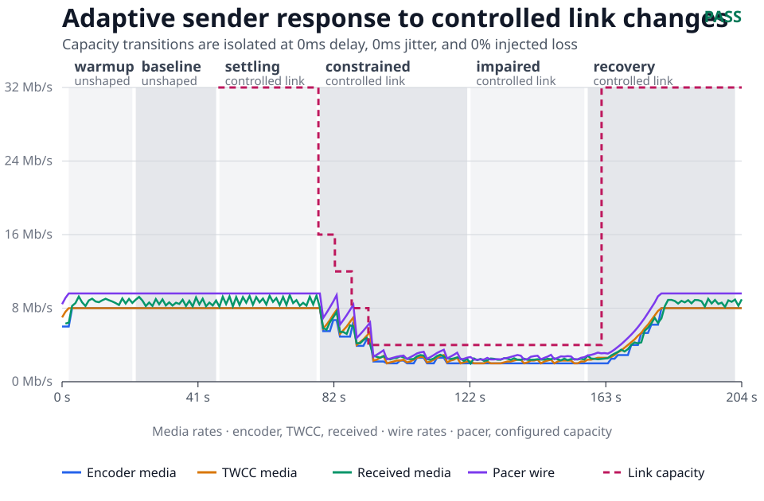

# Adaptive real-time WebRTC video

This reference implementation covers the path from a remote video source to a
browser-facing product. The device adapts its encoder to live congestion,
bounds sender queues, repairs recent packet loss, and keeps the WebRTC session
recoverable as network paths change. rstream publishes the WHEP control
surface through an outbound tunnel and supplies managed STUN/TURN connectivity;
media remains a standard WebRTC session between the device and viewer.

## One media core, three delivery paths

Every integration builds the Go code in [`producer/`](./producer/). Capture,
encoding, congestion control, pacing, repair, recovery, and OpenMetrics remain
one device-side implementation while control and distribution evolve around
it.

- The [standalone guide](https://rstream.io/guides/build-device-to-browser-webrtc-streaming-with-rstream)
  qualifies one WebRTC session between the producer and a browser.
- The [Next.js guide](https://rstream.io/guides/integrate-webrtc-video-streaming-into-a-nextjs-platform-with-rstream)
  runs the same producer in provisioning mode and adds product identity,
  authorization, and fleet state around that session.
- The [MediaMTX guide](https://rstream.io/guides/distribute-webrtc-video-with-mediamtx-and-rstream)
  adds an on-demand distribution backend. One adaptive upstream feeds
  multi-viewer fan-out while direct WebRTC remains available for one-to-one
  delivery and transport diagnosis.

In fan-out mode, the producer controls and measures the device-to-MediaMTX
upstream. MediaMTX and browser telemetry describe each downstream. Keeping
those congestion domains explicit preserves useful diagnosis as the delivery
architecture grows.

The implementation is split by responsibility:

- [`producer/`](./producer/) is the Go device agent. It captures with
  GStreamer, serves WHEP and diagnostics, controls Pion WebRTC, and owns
  the adaptive media loop and producer-side OpenMetrics exporter.
- [`platform/`](./platform/) is the Next.js product layer. It provisions
  devices, issues scoped producer and viewer access, and exposes live tunnel
  state without proxying the media session.
- [`distributor/`](./distributor/) is the optional MediaMTX backend. It opens
  one strict producer WHEP session on first demand and republishes a repaired
  H.264 stream for any number of viewers.

## Qualified reference path



The selected matrix contains three direct and three forced-rstream-relay runs
for both NACK/RTX and NACK/RTX/FlexFEC. Every run uses the same clean producer
revision and the same controlled 4 Mbit/s, 120 ms one-way delay, 30 ms jitter,
and 2% loss profile. The full protection profile passed all six release runs.

Under impairment, its direct median was 29.9 fps with 0.6% frozen time; the
relay median was 29.6 fps with 3.6% frozen time. Average H.264 QP remained 31.5
direct and 31.4 through the relay. The NACK/RTX-only relay baseline reached
16.2% median frozen time, making the gain from bounded proactive protection
visible rather than assumed.

The [qualification record](./producer/qualification/evidence/ca8a308/report.md)
contains the selected matrix, synchronized network, sender, playback, and
transport time series, mobility evidence, every automated gate, and the
rejected-run register.

The root Makefile targets the device role, so `make build`, `make run`,
`make test`, `make verify`, and `make clean` delegate to `producer/`. The
[producer README](./producer/README.md) starts with the standalone path and
continues through the congestion, repair, mobility, and qualification model.

Run the platform directly with npm:

```bash
cd platform
npm install
npm run prisma:migrate
npm run dev
```
