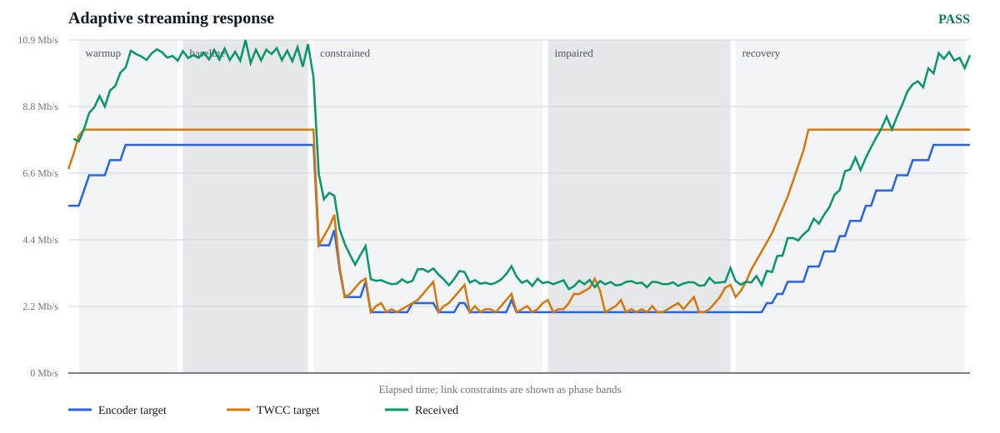

# WebRTC Video Producer

This example streams video from a device to a browser with WebRTC, publishes the viewer through an `rstream` HTTP tunnel, and uses the managed `rstream` STUN/TURN service for ICE connectivity.

The sample includes a complete device-side path: an embedded viewer UI, signaling on the same origin as the page, TURN credential bootstrap, H.264 and AV1 reference profiles, shared or per-viewer pipeline allocation, optional adaptive bitrate driven by TWCC/GCC, and Linux distribution builds that produce a standalone binary.

The process model is intentionally simple. One Go binary serves the viewer page locally, exposes the signaling WebSocket and TURN bootstrap endpoints, runs the GStreamer capture pipeline, and sends media with Pion. `rstream` provides the public entrypoint, tunnel authentication, tunnel reconnection, and TURN credential generation.

Treat this repository as a reference base rather than a fixed product. The profiles and build scripts are meant to be adapted to the capture device, encoder, authentication mode, and operational constraints of the deployment you actually want to run.

For a guided walkthrough of the architecture and the `rstream-go` integration,
see [Build Adaptive Real-Time Video Streaming with WebRTC and rstream](https://rstream.io/guides/build-device-to-browser-webrtc-streaming-with-rstream).

## Integration paths

This producer is the application-controlled path for products that combine
browser signaling, managed TURN, ICE recovery, congestion-aware encoding,
bounded media queues, packet repair, and session diagnostics. `rstream-go`
places tunnel lifecycle, cancellation, and recovery policy inside the same Go
process as the media application.

The repository also includes a pipeline-first path in
[`netcat-media-streaming`](../../netcat-media-streaming/). It connects
GStreamer or FFmpeg to `rstream nc` through standard input and output, which
fits private point-to-point streams whose media pipeline already owns buffering
and recovery. Both paths use the same rstream network: the CLI keeps the
integration compact, while the SDK exposes the controls required by a complete
video product.

## Architecture

The local HTTP server serves the embedded page and the small API surface the page needs: signaling, TURN bootstrap, and status endpoints. On the media side, a GStreamer pipeline produces H.264 or AV1 access units and passes them to a WebRTC sender built on top of Pion. `rstream-go` publishes that local server through an HTTP tunnel and keeps the public URL available.

That layout keeps signaling, TURN bootstrap, and viewer delivery on the same origin while avoiding any extra backend dedicated to this example.

## Requirements

Before running the example, install the `rstream` CLI, create a free `rstream` account, create a project, and select that project locally. The sample expects an active CLI context:

```bash
rstream login
rstream project use <project-endpoint>
```

For local development you need Go `1.26+`, a C compiler, `pkg-config`,
and a GStreamer installation that includes the development files and the
elements required by the selected pipeline. Node.js `20+` and npm are only
required when building the embedded local viewer UI with `make build`,
`make run`, or `make test`.

When using the Next.js platform provisioning profile, the producer does not
serve the embedded viewer UI. Use `make build-provisioning` for that mode; it
skips npm entirely and builds the binary with `web.viewer.enabled: false`
configs in mind.

The H.264 profiles use `videotestsrc`, `videoconvert`, `x264enc`, `h264parse`, and `appsink`. The AV1 profiles use `av1enc` and `av1parse` on top of the same structure.

### macOS

```bash
brew install go pkg-config gstreamer gst-plugins-base gst-plugins-good gst-plugins-bad gst-plugins-ugly
```

Install Node.js only if you want the producer binary to serve the embedded
viewer UI:

```bash
brew install node
```

### Ubuntu / Debian

```bash
sudo apt update
sudo apt install -y \
  build-essential \
  golang \
  gstreamer1.0-plugins-bad \
  gstreamer1.0-plugins-base \
  gstreamer1.0-plugins-good \
  gstreamer1.0-plugins-ugly \
  gstreamer1.0-tools \
  libgstreamer-plugins-base1.0-dev \
  libgstreamer1.0-dev \
  pkg-config
```

Install Node.js and npm only if you want the producer binary to serve the
embedded viewer UI:

```bash
sudo apt install -y nodejs npm
```

### Windows

Please run the sample inside WSL2. This repository does not ship a Windows-native distribution target for this example.

## Quick start

`config.h264.yaml` is the reference profile and the best place to start. It uses a test pattern source, H.264, and a fixed encoder bitrate. `config.av1.yaml` keeps the same overall architecture and switches the codec path to AV1.

```bash
cp config.h264.yaml config.yaml
make build
./webrtc-video-producer -config ./config.yaml
```

If you want to start from AV1 instead:

```bash
cp config.av1.yaml config.yaml
```

When the tunnel is ready, the process prints the public URL:

```text
info  Public URL: https://xxxxxxxx.t.<cluster-domain>
```

Open that URL in a browser and wait for the sample status to load. Select an ICE policy, then click `Start streaming`. The page opens the signaling WebSocket on the tunnel origin, requests TURN credentials from the local process, and attaches the remote video track once the WebRTC session is established. A working session shows `Peer: connected`, `ICE: connected` or `completed`, and `Playback: Playing`.

The viewer page also includes an ICE path selector. `Auto` keeps the default behavior, `Direct` disables TURN on the browser side, and `Relay only` forces the browser to use TURN. That selector only affects the browser peer; it does not override `webrtc.useTurn` in the Go process.

If you want to run the same application locally without publishing a tunnel:

```bash
make run-local
```

That serves the viewer on `http://127.0.0.1:8080`.

## Reference profiles

The repository ships a small set of reference YAML files so you can start from known working configurations.

- `config.h264.yaml` and `config.av1.yaml` use a test-pattern source and are useful when you want to validate the WebRTC path itself.
- `config.provisioning.h264.yaml` keeps the H.264 media path and moves tunnel credentials and TURN credentials to a product API.
- `config.macos-webcam.h264.yaml` and `config.macos-webcam.av1.yaml` are the macOS webcam variants built around `avfvideosrc`.
- `config.raspberry-pi-camera.h264.yaml` and `config.raspberry-pi-camera.av1.yaml` are the Raspberry Pi variants built around `libcamerasrc`.
- The `.twcc-gcc.yaml` variants enable adaptive bitrate. The plain variants keep TWCC enabled but leave the encoder on a fixed target bitrate.
- `config.test-pattern.h264.twcc-gcc-flexfec.yaml` is the loss-resilient
  reference used by the direct-versus-rstream qualification. It adds proactive
  FlexFEC to TWCC/GCC, NACK, and RTX without changing the normal quick start.

Use those files as starting points. On a real device you will often need to adjust the device index, resolution, frame rate, or encoder settings.

## Configuration

Start from one of the shipped profiles and adjust only the sections you need. That is a better fit for this example than building a full config file up front.

The configuration is split by responsibility:

- `server` controls the local HTTP listener.
- `web` controls whether the producer serves its local viewer.
- `tunnel` controls publication through `rstream`, edge authentication, provisioning, and tunnel reconnection.
- `turn` controls TURN credential lifetime.
- `webrtc` controls codec settings, interceptors, adaptive bitrate, and viewer limits.
- `media` controls the GStreamer pipeline itself and how pipelines are allocated across viewers.
- `logging` controls verbosity.

### Tunnel publication and authentication

`tunnel.enabled` decides whether the process publishes the local server through `rstream` or stays local-only.

`tunnel.transport.mode` controls the producer-to-rstream upstream session. The default `auto` mode prefers QUIC and falls back to TLS while opening the control channel, then keeps that choice for the client lifetime. The published tunnel remains a standard HTTP tunnel for the browser UI, signaling WebSocket, and API endpoints; this setting only changes how the Go producer connects to the rstream engine.

```yaml
tunnel:
  transport:
    mode: auto
```

`tunnel.auth.token` and `tunnel.auth.rstream` decide which edge authentication policies the tunnel enforces. The producer never builds a second public URL with an embedded token. It logs only the published tunnel URL returned by `rstream`.

```yaml
tunnel:
  auth:
    token: false
    rstream: false
```

When token authentication is enabled, viewer tokens must be distributed by another trusted surface, such as your product API, the rstream dashboard, or an operator workflow. The device-side process does not leak its own client token into a shareable URL.

The shipped local profiles publish a public viewer URL by default so the sample behaves like a simple developer tunnel. Enable `token` or `rstream` authentication explicitly when the public viewer must be protected.

`tunnel.reconnect.enabled` controls what happens when the HTTP tunnel drops. If it is enabled, the process recreates the tunnel after `tunnel.reconnect.interval` and logs the new public URL. If it is disabled, a tunnel disconnect becomes a clean process exit.

### Remote provisioning

`config.provisioning.h264.yaml` is the product-integration profile used by the Next.js platform example. In that mode, the producer does not read a local rstream CLI context. It calls the product API configured under `tunnel.provisioning`, receives the short-lived rstream client configuration required to create one tunnel, and then creates that tunnel from those values.

```yaml
web:
  viewer:
    enabled: false
tunnel:
  auth:
    token: false
    rstream: false
  provisioning:
    mode: remote
    endpoint: ${API_URL}
    secret: ${DEVICE_SECRET}
```

`API_URL` and `DEVICE_SECRET` belong to the third-party product, not to rstream. The `RSTREAM_*` values stay on that product backend, where the app can issue scoped producer and viewer tokens.

When `tunnel.provisioning.mode` is `remote`, local tunnel auth is disabled in the producer config because the product API issues the scoped tunnel creation token. The producer always requests a token-authenticated HTTP tunnel in that mode, and the short-lived token issued by the product API enforces the exact tunnel creation policy. TURN credentials stay separate: the producer asks the product API for fresh TURN credentials whenever the WebRTC path needs them.

Build that provisioning binary without the embedded viewer UI:

```bash
make build-provisioning
```

That target is equivalent to `make build EMBEDDED_WEB=0`. If a binary built
that way is started with `web.viewer.enabled: true`, startup fails with a clear
configuration error because the viewer assets are intentionally absent.

### TURN and ICE

`turn.ttl` controls the lifetime of TURN credentials minted by the local
process. An optional `turn.transports` allowlist can restrict both the embedded
browser response and the Go peer to `udp`, `tcp`, `dtls`, and/or `tls`. Empty
means all URLs returned by rstream. This is primarily a deployment-policy and
diagnostic control for networks that prohibit particular transports; prefer all
transports unless the target network has been measured.

```yaml
turn:
  ttl: 10m
  transports: [udp, tcp, dtls, tls]
```

`webrtc.useTurn` controls whether the Go peer itself uses the managed `rstream`
TURN service. The browser can still be forced into direct or relay-only mode
from the viewer page, but the default path keeps both peers on the same TURN
service when relay is required.

`webrtc.iceTransportPolicy` controls candidate selection on the Go peer. `all`
is the default and lets ICE prefer a direct candidate while retaining TURN
fallbacks. `relay` accepts only relay candidates and therefore requires
`webrtc.useTurn: true`; use it for egress-restricted deployments and
qualification, not as an accidental default because every media packet then
crosses TURN.

```yaml
webrtc:
  useTurn: true
  iceTransportPolicy: all # or relay
```

The signaling path uses Trickle ICE: both peers exchange candidates as soon as they are discovered. If the selected network path disappears during playback, the browser keeps the same WebRTC session and sends a new offer with ICE restart enabled. The producer keeps the session open during that recovery window and only closes it if ICE does not reconnect.

### Codecs and media pipelines

`webrtc.video.mimeType` selects the codec advertised to the browser. The sample supports `video/H264` and `video/AV1`.

H.264 is the reference path and the better default when you want predictable live behavior across browsers and machines. The AV1 profiles are included because codec negotiation and transport behavior are worth testing too, but live AV1 capture remains more sensitive to machine and encoder characteristics.

On macOS webcam pipelines, keep `format=I420` before `av1enc`. That avoids format negotiation paths that are known to be unreliable for browser playback.

`media.pipeline` is passed directly to GStreamer through `gst_parse_launch`. If you add new elements to a profile, remember that the static Linux build must include those same elements. Any pipeline change that adds dependencies should therefore be reflected in `build-gstreamer-static-linux.sh`.

### Transport feedback and packet repair

`webrtc.interceptors` controls the feedback and recovery path.

`twcc` enables Transport-Wide Congestion Control feedback. `nack` enables packet-loss feedback. `rtx` enables retransmission payloads so those loss reports can actually be repaired. The reference profiles keep all three enabled because that combination is practical and broadly supported.

`flexFEC` stays off in the quick-start profiles because proactive repair spends
bandwidth even when a link is healthy. The loss-resilient reference enables it
at two repair packets per four media packets. Pion interleaves the media across
two independent XOR groups, so each repair can recover one missing packet in
its own group; this is different from recovering any two losses in the complete
window. Shorter groups reduced late reactive repair and visible freezes in the
controlled loss comparison. The sender includes the 50% packet overhead in its
wire-rate congestion budget rather than filling the link with encoder traffic
and appending FEC on top.

GCC keeps its target in media bitrate because Chromium acknowledges primary and
RTX packets through TWCC, but not the FlexFEC stream. The pacer converts that
media target into the protected wire budget and schedules media plus repair
inside it. Keeping the two units at their respective boundaries lets GCC
compare its target with the traffic it actually observes and rediscover
available capacity after congestion clears.

Use `config.test-pattern.h264.twcc-gcc-flexfec.yaml` when loss resilience is the
goal. Use a NACK/RTX-only adaptive profile when capacity is scarce and measured
loss/RTT show that reactive repair is sufficient. In both cases, qualify the
real target network rather than treating the reference ratio as universal.

### Adaptive bitrate

`webrtc.adaptive` controls encoder bitrate adaptation. The current backend is `twcc-gcc`.

TWCC is Transport-Wide Congestion Control feedback from the browser. GCC is Google Congestion Control. In this sample, the transport estimate comes from the standard Pion TWCC/GCC path, and the application then applies bounded bitrate updates to the active `x264enc` or `av1enc` instance.

The configured minimum is applied to both the encoder controller and the RTP
pacer. Pion's public send-side minimum bounds its delay controller, while its
loss controller has a separate internal 100 kbit/s floor. Without an aligned
pacer floor, a loss event can pace far below the encoder minimum and accumulate
an unbounded queue even though the encoder has already respected the
application profile. The small pacer adapter in this sample prevents that
split-brain state; the raw loss and delay targets remain exposed in the session
diagnostics so qualification can distinguish a conservative loss estimate from
the effective encoder and pacing limits.

The pacer permits at most 225 ms of transient backlog at the sustained rate. If
a source overshoot exceeds that envelope, the sender drops complete encoded
access units before RTP packetization and waits for a key frame before
resuming. The request is deferred until the queue has room for the most recent
key-frame size plus 25% headroom; this avoids generating a recovery frame only
to reject it at the same admission boundary. The pacer neither deletes already
packetized RTP nor bursts above GCC's budget to make a local queue metric look
healthy. This avoids artificial RTP gaps, partial-frame corruption, and
key-frame storms while keeping hard RTP queue exhaustion actionable. Complete
frame drops, actual packet residence time, prospective sustained-rate backlog,
the key-frame reserve, and packet-level rejections are exposed in the session
diagnostics and qualification report.

The pacing envelope derives its sustained wire target from GCC's media target
and the configured FlexFEC ratio, then reserves 1.5× that wire rate for normal
encoded-frame bursts and prompt packet repair. The burst allowance is distinct
from the sustained repair budget: counting the FlexFEC overhead twice would
remove the headroom needed to packetize a protected key frame. The 225 ms
admission ceiling and complete-access-unit gate keep the allowance from
becoming unbounded buffering.

Material target decreases are applied to the encoder immediately when fresh
feedback requires them. Callback bursts are coalesced to the newest value, and
the controller re-reads GCC's current target before every periodic decision so
an out-of-order callback can never apply a stale increase. Increases follow
GCC's own bounded estimate at `updateInterval`; a second encoder ramp would
make the sender application-limited and deprive GCC of the traffic needed to
confirm recovered capacity. The first increase after a measured-loss hold
requests one coalesced recovery key frame, shortening the time to a fresh
decodable image without adding one to every healthy increase. New access units
continue to use the sustained target for admission. Already packetized units
keep their RTP sequence continuity and drain only at the current GCC budget;
the report records the estimator-induced backlog separately from actual packet
residence time so a target decrease cannot hide bufferbloat behind a derived
queue value.

Transport-wide sequence numbers are assigned at actual pacer egress, after the
bounded repair-priority scheduler has chosen the next packet. Assigning them
before that scheduler would turn intentional RTX prioritization into apparent
packet loss at the receiver. Primary and RTX packets share this contiguous
sequence space; FlexFEC remains outside it because Chromium does not report
that repair stream through TWCC. The qualification report cross-checks the
resulting feedback loss against independent Linux traffic-control counters.

Pion publishes target changes asynchronously. A late callback may therefore
carry a value older than the estimator's current target. The adapter always
re-reads the locked current target when delivering a callback and counts
superseded values, so callback scheduling cannot roll the encoder back to a
stale bitrate.

The backend governs encoder bitrate within an established WebRTC session.
Resolution, frame rate, and capture profile remain stable, which keeps the
transport feedback loop measurable and avoids pipeline rebuilds during a
session. One feedback loop therefore controls one encoder: use
`media.mode: per-viewer` or set `webrtc.maxViewers: 1`. Products that must span a
wider capacity range can add a measured source ladder above this backend.

The main settings are:

- `webrtc.initialBitrateKbps`, which seeds the sender before the first TWCC reports arrive
- `webrtc.adaptive.enabled`, which turns adaptation on or off
- `webrtc.adaptive.backend`, which selects the backend
- `webrtc.adaptive.twccGCC.minBitrateKbps` and `maxBitrateKbps`, which define the allowed range (500–8000 kbit/s is supported; the 1080p30 H.264 examples keep a quality-protecting 2000 kbit/s floor)
- `webrtc.adaptive.twccGCC.updateInterval`, which sets how often bitrate changes may be applied
- `webrtc.adaptive.twccGCC.changeThresholdPct` and `decreaseThresholdPct`, which keep small estimator fluctuations from reconfiguring the encoder while preserving the available pacing headroom; startup validation rejects a decrease threshold that the configured FlexFEC ratio cannot safely absorb
- `webrtc.adaptive.twccGCC.maxIncreaseLossPct`, which prevents a delayed estimator increase from raising the encoder target while measured packet loss is still above the configured recovery threshold

#### Reference operating envelope

The reference settings form one coherent 1080p30 qualification profile. Its
limits were exercised together across the direct and relay matrices; changing
the codec, frame cadence, resolution, CPU budget, or network envelope calls for
a new qualification run. Each report records the Git revision that produced
the result, so the measured trade-offs remain tied to an exact implementation.

| Setting                |                                              Reference value | Reason and trade-off                                                                                                                                                                                                                                                                                                                                                                     |
| ---------------------- | -----------------------------------------------------------: | ---------------------------------------------------------------------------------------------------------------------------------------------------------------------------------------------------------------------------------------------------------------------------------------------------------------------------------------------------------------------------------------- |
| Frame size and cadence |                                          1920x1080 at 30 fps | Exercises a real live-video workload while remaining reproducible. If the link cannot sustain the quality floor, add a measured resolution/frame-rate ladder instead of compressing this fixed profile indefinitely.                                                                                                                                                                     |
| x264 latency controls  |                       `zerolatency`, `veryfast`, `bframes=0` | Avoids frame reordering and deep encoder buffering. The `zerolatency` tune owns its internally coherent lookahead and threading choices; duplicating those private tune settings in the pipeline made the profile harder to reason about without establishing a measured benefit. A slower preset may improve compression, but it spends CPU and can add latency on constrained devices. |
| Key-frame policy       |                               `key-int-max=60`, `scenecut=0` | Gives the qualification source a deterministic maximum two-second GOP at 30 fps, so recovery runs are comparable. Content-driven production encoders may re-enable scene cuts after measuring their key-frame bursts.                                                                                                                                                                    |
| Encoder VBV            |                                                       250 ms | Bounds the encoder-side rate reservoir while retaining enough room for normal frame-size variation. It is one component of latency, not a promise that end-to-end delay is 250 ms.                                                                                                                                                                                                       |
| Initial encoder target |                                                     5 Mbit/s | Starts 1080p with useful quality before TWCC has accumulated enough feedback. A high startup target can briefly overshoot a smaller access link, which is why the pacer still enforces the current wire budget.                                                                                                                                                                          |
| Adaptive range         |                                                   2–8 Mbit/s | The 2 Mbit/s floor protects fixed 1080p quality observed through x264 QP; the ceiling bounds CPU and link demand. Operating below the floor calls for a source ladder, not a hidden quality collapse.                                                                                                                                                                                    |
| Update hysteresis      |                      2 s, 10% increases, immediate decreases | Filters estimator noise while keeping the encoder aligned with the capacity granted by GCC. Decreases bypass the periodic update gate; increases follow GCC after the loss-recovery hold.                                                                                                                                                                                                 |
| Pacing and admission   | Shared 1.5x media envelope, 225 ms sustained-backlog ceiling | Media, proactive repair, and retransmissions share one pacing allowance. The admission ceiling preserves 150 ms of scheduling margin under the measured 375 ms packet-residence budget. Over-budget access units are rejected whole before RTP packetization.                                                                                                                            |
| Repair scheduling      |        One repair packet per scheduling burst; 225 ms expiry | Gives RTX a prompt opportunity without starving current media, and discards a repair packet once its playback value is lower than the latency it would add.                                                                                                                                                                                                                              |
| FlexFEC                |                     One repair packet per five media packets | Adds moderate proactive protection for lossy, higher-RTT paths where reactive RTX can arrive after the playout window. Stronger ratios remain explicit stress profiles; leave FlexFEC disabled when measured NACK/RTX recovery is sufficient or the link cannot afford the overhead.                                                                                                    |

With the 1080p30 H.264 reference settings, the sender starts at `5 Mbps` and may
adapt within the `2–8 Mbps` range. Qualification showed that allowing the fixed
1080p encoder to fall to 1.2–1.5 Mbps could preserve frame delivery while
pushing x264 into visibly destructive quantization. The reference therefore
protects image quality with a 2 Mbps media floor and qualifies the full
NACK/RTX/FlexFEC profile on a 4 Mbps wire budget. A deployment that must operate
below that point should add a measured resolution/frame-rate ladder instead of
silently degrading a fixed 1080p stream. The viewer page exposes the codec, the
enabled recovery path, the adaptive backend state, the current TWCC target, and
the current encoder target so you can validate the behavior without immediately
jumping into browser internals.

For repeatable evidence rather than an interactive spot check, use
`qualification/adaptive-streaming/run-matrix.sh`. The isolated harness compares
the rstream TURN path with a direct Docker reference under the same selective
media impairment and records bitrate, controller internals, decoded frame rate,
freezes, NACK/RTX/FEC activity, RTT, continuity, and recovery. The isolated
direct-path filter follows the peer address rather than the first ICE port, so
a legitimate candidate-pair switch cannot escape later impairment phases. A
single `qualification/adaptive-streaming/run.sh` invocation remains useful
while debugging one path/profile combination. The normal quick start does not
require Docker or the qualification tooling.



The [reference evidence pack](./qualification/evidence/6706cfd/report.md) keeps
the selected direct, rstream relay, and producer-mobility runs from revision
`6706cfd`. The direct path reached a 7.5 Mbit/s encoder target on the healthy
link, adapted to 2 Mbit/s under the controlled 4 Mbit/s/120 ms/2% loss profile,
then recovered to 5.5 Mbit/s with 30 fps and no measured freeze. The relay run
kept 1080p near 30 fps and remained inside the 10% impaired-freeze budget. The
mobility run changed the producer interface and source address, trickled a new
candidate over QUIC signaling, switched the selected ICE pair, and recovered
playback in 1.006 seconds without replacing the peer connection or closing the
signaling WebSocket.

The comparison does not equate frame delivery with visual quality. The pinned
qualification encoder reports its per-frame H.264 quantization parameter (QP),
while Chromium independently reports decoded frame rate, freezes, resolution,
and decode cost. The checks bound both the absolute sender QP and the
relay-to-direct QP gap while requiring 1920x1080 output throughout the run. This
catches a stream that remains at 30 fps only by compressing the image too
aggressively, without pretending that sender QP alone is an end-to-end image
similarity score.

### Viewer limits and pipeline allocation

`webrtc.maxViewers` limits how many viewers may connect at the same time. `0` means unlimited. Any positive value enforces a fixed limit and rejects extra viewers.

`media.mode` controls how GStreamer pipelines are allocated. `shared` keeps one pipeline alive while at least one viewer is connected. `per-viewer` creates one pipeline per viewer and tears it down when that viewer disconnects. In both modes, zero connected viewers means no running pipeline.

## Testing degraded connectivity

If you want to validate adaptive bitrate, shape the real device-side network path instead of only throttling page load. On Linux, `tc netem` is the most useful baseline because it affects the actual UDP media traffic.

Apply shaping on the interface that carries viewer traffic, for example `wlan0`:

```bash
sudo tc qdisc add dev wlan0 root netem delay 80ms 20ms loss 3% rate 2mbit
```

Tighten the path further:

```bash
sudo tc qdisc change dev wlan0 root netem delay 160ms 40ms loss 6% rate 1mbit
```

Remove the shaping afterwards:

```bash
sudo tc qdisc del dev wlan0 root netem
```

When adaptive bitrate is enabled, the useful signals on the viewer page are `TWCC target` and `Encoder target`. The transport estimate should move first, and the encoder target should then follow within the configured update interval.

## Build and distribution

For local development:

```bash
make build
make run
```

`make build` embeds the local viewer UI and therefore requires Node.js and npm.
For the Next.js platform provisioning profile, use the no-viewer build:

```bash
make build-provisioning
```

For a local-only run:

```bash
make run-local
```

For tests:

```bash
make test
```

The repository also ships Docker-based static packaging targets for Linux:

```bash
make dist-linux-amd64
make dist-linux-arm64
make dist
```

Artifacts are written to `dist/linux-amd64` and `dist/linux-arm64`.

Those targets build a static Linux binary linked against a statically packaged `gstreamer-full` toolchain. The Docker build compiles the GStreamer subset needed by the sample, including `x264`, `libaom`, the parsers, and the `appsink` path, then links the Go binary against that toolchain with `musl`.

The practical outcome is a standalone executable you can copy to a target machine without asking that machine to install the full GStreamer development stack first. In other words, `make dist` is the path you use when you want to build once and then copy the resulting binary to a remote device.

That static toolchain is defined in `build-gstreamer-static-linux.sh`. If you change the reference pipelines and introduce new elements or plugins, update that script as well. Otherwise the local development setup may keep working while the static distribution build silently stops matching the pipeline you intend to run.

## Troubleshooting

`make build`, `make build-provisioning`, and `make test` run a preflight check
before compiling Go. If `pkg-config` or the GLib/GStreamer development files
are missing, the build prints the exact missing pkg-config packages and points
back to the install commands above.

If the process fails with `failed to create the GStreamer pipeline`, one or more configured elements are missing. Install the required plugins or adapt `media.pipeline` to the elements available on the target machine.

If the process cannot connect to the `rstream` engine server, verify the current CLI context with `rstream login` and `rstream project use <project-endpoint> --default`, then inspect `~/.rstream/config.yaml`.

If TURN credential generation fails, verify the current project endpoint, the active authentication token, and the TURN routing fields stored in the local `rstream` context.

If the public URL opens but no video appears, start with the runtime log, the selected GStreamer pipeline, browser autoplay and permissions, TURN reachability from both peers, and the availability of the chosen encoder on the target machine.
