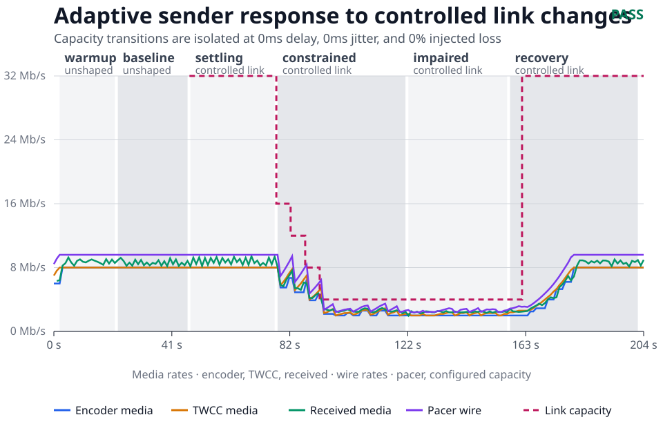

# WebRTC Video Producer

This example streams video from a device to a browser with WebRTC, publishes the viewer through an `rstream` HTTP tunnel, and uses the managed `rstream` STUN/TURN service for ICE connectivity.

The sample includes a complete device-side path: an embedded viewer UI, WHEP on the same origin as the page, TURN credential bootstrap, H.264 and AV1 reference profiles, shared or per-viewer pipeline allocation, optional adaptive bitrate driven by TWCC/GCC, and Linux distribution builds that produce a standalone binary.

The process model is intentionally simple. One Go binary serves the viewer page locally, exposes a WHEP endpoint and TURN bootstrap endpoint, runs the GStreamer capture pipeline, and sends media with Pion. `rstream` provides the public entrypoint, tunnel authentication, tunnel reconnection, and TURN credential generation.

Treat this repository as a reference base rather than a fixed product. The profiles and build scripts are meant to be adapted to the capture device, encoder, authentication mode, and operational constraints of the deployment you actually want to run.

For a guided walkthrough of the architecture and the `rstream-go` integration,
see [Build Adaptive Real-Time Video Streaming with WebRTC and rstream](https://rstream.io/guides/build-device-to-browser-webrtc-streaming-with-rstream).

For a shared organization platform with an existing rstream CLI setup,
[`config.discovery.h264.yaml`](./config.discovery.h264.yaml) publishes a stable
`device` UUID and optional `device-name` label instead of obtaining a device
secret. See the [platform inventory configuration](../platform/README.md#select-managed-or-discovered-inventory).
Keep the UUID across reconnects; the name may change. Other local profiles may
also set `tunnel.labels`. Remote provisioning owns its labels and rejects local
label overrides.

## One media core, three delivery paths

This Go codebase is the device-side foundation for the complete video series.
It owns capture, encoding, congestion control, pacing, packet repair, session
recovery, and producer metrics. The surrounding control and distribution planes
evolve without forking that implementation.

The [standalone guide](https://rstream.io/guides/build-device-to-browser-webrtc-streaming-with-rstream)
establishes the reference media path between one producer and one browser. The
[Next.js guide](https://rstream.io/guides/integrate-webrtc-video-streaming-into-a-nextjs-platform-with-rstream)
runs this producer in provisioning mode and adds device identity, viewer
authorization, fleet state, and product policy. WHEP and media still terminate
on the selected media backend; Next.js does not proxy them.

The MediaMTX guide adds an on-demand distribution adapter around the same
codebase. One adaptive device upstream feeds MediaMTX, which can then serve
several viewers without multiplying device uplink usage. Direct WebRTC remains
available for one-to-one sessions and transport diagnosis; ICE still chooses
direct or TURN connectivity for that session.

Across all three shapes, the capture pipeline, encoder, adaptive controller,
pacer, repair strategy, recovery logic, and producer metrics remain one
implementation to operate and qualify. The control plane decides who may start
or watch a stream. The distribution plane decides whether the encoded stream
goes to one browser or to a fan-out tier.

Fan-out creates two congestion domains. The adapter terminates repair on this
producer's shared upstream; MediaMTX and each viewer establish a separate
downstream control loop. Producer OpenMetrics describe the device uplink,
while MediaMTX and browser telemetry describe viewer delivery.

## Integration paths

This producer is the application-controlled path for products that combine
WHEP session control, managed TURN, ICE recovery, congestion-aware encoding,
bounded media queues, packet repair, and session diagnostics. `rstream-go`
places tunnel lifecycle, cancellation, and recovery policy inside the same Go
process as the media application.

The repository also includes a pipeline-first path in
[`netcat-media-streaming`](../../netcat-media-streaming/). It connects
GStreamer or FFmpeg to `rstream nc` through standard input and output, which
fits private point-to-point streams whose media pipeline already owns buffering
and recovery. Both paths use the same rstream network: the CLI keeps the
integration compact, while the SDK exposes the controls required by a complete
video product.

## Standalone path

The local HTTP server serves the embedded page and the small API surface the page needs: WHEP resources, TURN bootstrap, and status endpoints. On the media side, a GStreamer pipeline produces H.264 or AV1 access units and passes them to a WebRTC sender built on top of Pion. `rstream-go` publishes that local server through an HTTP tunnel and keeps the public URL available.

That layout keeps WHEP, TURN bootstrap, and viewer delivery on the same origin while avoiding any extra backend dedicated to this example.

## Requirements

Before running the example, install the `rstream` CLI, create a free `rstream` account, create a project, and select that project locally. The sample expects an active CLI context:

```bash
rstream login
rstream project use <project-endpoint>
```

For local development you need Go `1.27+`, a C compiler, `pkg-config`,
and a GStreamer installation that includes the development files and the
elements required by the selected pipeline. Use Node.js `24 LTS` for the
embedded viewer build. Node.js and npm are only required with `make build`,
`make run`, or `make test`.

When using the Next.js platform provisioning profile, the producer does not
serve the embedded viewer UI. Use `make build-provisioning` for that mode; it
skips npm entirely and builds the binary with `web.viewer.enabled: false`
configs in mind.

The H.264 profiles use `videotestsrc`, `videoconvert`, `x264enc`, `h264parse`, and `appsink`. The AV1 profiles use `av1enc` and `av1parse` on top of the same structure.

The bundled H.264 profiles use 720p30 and explicitly constrain the encoded
stream to level 3.1, matching their SDP and the browser receive offers tested
with this sample. Earlier 1080p profiles emitted level 4 while announcing 3.1.
The producer now checks the receiver's level and maximum bitrate before
answering, including fixed pipelines without optional format control.
Custom 1080p30 pipelines remain possible with a matching level 4 encoder/SDP
configuration and receivers that advertise sufficient capacity on every leg.
`level-asymmetry-allowed=1` does not grant additional receive capacity;
see [RFC 6184, section 8.2.2](https://www.rfc-editor.org/rfc/rfc6184#section-8.2.2).
Keep custom encoded caps within the declared limits; the producer does not
rewrite arbitrary pipelines or infer camera capabilities from pipeline text.
The reference MediaMTX adapter currently advertises level 3.1 on both legs.

### macOS

```bash
brew install go pkg-config gstreamer gst-plugins-base gst-plugins-good gst-plugins-bad gst-plugins-ugly
```

Install Node.js only if you want the producer binary to serve the embedded
viewer UI:

```bash
brew install node
```

### Ubuntu / Debian

Install Go `1.27+` using the [Go installation instructions](https://go.dev/doc/install)
and check `go version`. The distribution's default `golang` package can be
older than the module requires. Then install the native dependencies:

```bash
sudo apt update
sudo apt install -y \
  build-essential \
  gstreamer1.0-plugins-bad \
  gstreamer1.0-plugins-base \
  gstreamer1.0-plugins-good \
  gstreamer1.0-plugins-ugly \
  gstreamer1.0-libav \
  gstreamer1.0-tools \
  libgstreamer-plugins-base1.0-dev \
  libgstreamer1.0-dev \
  pkg-config
```

Install [Node.js 24 LTS with npm](https://nodejs.org/en/download) only if you
want the producer binary to serve the embedded viewer UI. Check the versions
before building; distribution packages may provide an older Node.js release:

```bash
node --version
npm --version
```

For the Raspberry Pi camera profiles, also install the platform's libcamera
GStreamer plugin (`gstreamer1.0-libcamera` on Debian) and check
`gst-inspect-1.0 libcamerasrc`. Camera access and its drivers are requirements
of those profiles, separate from the test-pattern source.

### Windows

Please run the sample inside WSL2. This repository does not ship a Windows-native distribution target for this example.

## Quick start

`config.h264.yaml` is the reference profile and the best place to start. It uses a test pattern source, H.264, and a fixed encoder bitrate. `config.av1.yaml` keeps the same overall architecture and switches the codec path to AV1.

```bash
cp config.h264.yaml config.yaml
make build
./webrtc-video-producer -config ./config.yaml
```

If you want to start from AV1 instead:

```bash
cp config.av1.yaml config.yaml
```

When the tunnel is ready, the process prints the public URL:

```text
info  Public URL: https://xxxxxxxx.t.<cluster-domain>
```

Open that URL in a browser and wait for the sample status to load. Select an ICE policy, then click `Start streaming`. The page creates a WHEP resource on the tunnel origin, trickles ICE candidates over HTTP, requests TURN credentials from the local process, and attaches the remote video track once the WebRTC session is established. A working session shows `Peer: connected`, `ICE: connected` or `completed`, and `Playback: Playing`.

The viewer page also includes an ICE path selector. `Auto` keeps the default behavior, `Direct` disables TURN on the browser side, and `Relay only` forces the browser to use TURN. That selector only affects the browser peer; it does not override `webrtc.useTurn` in the Go process.

If you want to run the same application locally without publishing a tunnel:

```bash
make run-local
```

That serves the viewer on `http://127.0.0.1:8080`.

## Reference profiles

The repository ships a small set of reference YAML files so you can start from known working configurations.

- `config.h264.yaml` and `config.av1.yaml` use a test-pattern source and are useful when you want to validate the WebRTC path itself.
- `config.provisioning.h264.yaml` applies the qualified adaptive H.264,
  NACK/RTX, and one-per-five FlexFEC profile while moving tunnel and TURN
  credentials to a product API. It admits one upstream session so direct and
  distributed delivery never run competing feedback loops against one shared
  encoder.
- `config.macos-webcam.h264.yaml` and `config.macos-webcam.av1.yaml` are the macOS webcam variants built around `avfvideosrc`.
- `config.raspberry-pi-camera.h264.yaml` and `config.raspberry-pi-camera.av1.yaml` are the Raspberry Pi variants built around `libcamerasrc`.
- The `.twcc-gcc.yaml` variants enable adaptive bitrate. The plain variants keep TWCC enabled but leave the encoder on a fixed target bitrate.
- `config.test-pattern.h264.twcc-gcc-flexfec.yaml` is the loss-resilient
  reference used by the direct-versus-rstream qualification. It adds proactive
  FlexFEC to TWCC/GCC, NACK, and RTX without changing the normal quick start.

Use those files as starting points. On a real device you will often need to adjust the device index, resolution, frame rate, or encoder settings.

## Configuration

Start from one of the shipped profiles and adjust only the sections you need. That is a better fit for this example than building a full config file up front.

The configuration is split by responsibility:

- `server` controls the local HTTP listener.
- `metrics` controls the optional producer-side OpenMetrics listener.
- `web` controls whether the producer serves its local viewer.
- `tunnel` controls publication through `rstream`, edge authentication, provisioning, and tunnel reconnection.
- `turn` controls TURN credential lifetime.
- `webrtc` controls codec settings, interceptors, adaptive bitrate, and viewer limits.
- `media` controls the GStreamer pipeline itself and how pipelines are allocated across viewers.
- `logging` controls verbosity.
- `quality` optionally advertises source bitrate presets.

### Optional source quality presets

Presets are opt-in. Existing configurations and the public demo keep their
current behavior and show no selector. Start with
`config.provisioning.quality.h264.yaml` for the Next.js/MediaMTX adapter path,
or add this section to an authenticated adaptive standalone profile:

```yaml
quality:
  default: auto
  presets:
    - id: low
      label: Low
      bitrateKbps: 1000
    - id: medium
      label: Medium
      bitrateKbps: 4000
    - id: high
      label: High
      bitrateKbps: 10000
```

Configure `webrtc.adaptive.twccGCC.minBitrateKbps: 500` and
`maxBitrateKbps: 10000` for this example. Every preset must fit that range.
The supported maximum is 50000 kbit/s; the default remains 8000. Larger values
require a pipeline, hardware, and uplink qualified for that rate.

Each preset is a ceiling on the adaptive encoder target. It excludes RTP/RTCP,
retransmission, and FEC overhead; actual network traffic can exceed this value.
Without `media.format`, resolution and frame rate remain defined by the pipeline. The congestion loop
continues protecting the uplink and may reduce the actual rate. Auto restores
that loop's full configured range. Presets require TWCC/GCC adaptation and a controllable encoder; the reduced
native MediaMTX offer profile cannot enable them. Use the custom adapter when
presets and MediaMTX are needed together.

The shared embedded and Next.js readers discover modes dynamically. Selection
is device-wide, including future sessions in the running process, and defaults
to Auto unless `quality.default` names another configured preset. Restarting the
process restores that configured default. An idle producer retains the selected
mode without starting a capture pipeline.

The control API uses the existing HTTP surface:

- `GET /api/quality` returns modes, `selected`, opaque `version`, active encoder
  count, minimum/maximum applied target, and failed encoder update count.
- An unconfigured producer returns `204` for discovery. Older binaries return
  `404`; both readers also accept that response.
- `PUT /api/quality` accepts exactly `{"mode":"low","version":"…"}`.
  Read the version first. A concurrent or previous-process version returns `409`;
  an unknown mode returns `400`. Successful selection accepts the policy change;
  the applied target converges asynchronously and is reported separately.

Request bodies are bounded, responses are not cached, and cross-origin mutations
are rejected. Exposed presets require remote provisioning or authenticated
rstream publication. With tunneling disabled, bind the server to a literal
loopback IP; the local control endpoint also validates the Host header. An
edge-authenticated standalone viewer needs a token that permits `/api/quality`.
Platform viewer tokens deliberately do not carry that permission: the platform
proxies control using a separate server-held token.

### Optional source resolution and frame rate

`config.provisioning.source-formats.h264.yaml` adds three source profiles to
the existing quality controls: 640×360 at 15 fps, 960×540 at 24 fps and 1280×720
at 30 fps. It uses the same provisioning credentials and custom MediaMTX
adapter as the bitrate-only example. This is a separate, opt-in configuration;
existing profiles keep their current pipeline and bitrate-only behavior.

For CLI-backed discovery, retain the `tunnel` configuration from
`config.discovery.h264.yaml` and copy the `media`, `quality` and `webrtc`
sections from the format example. This preserves the project context, token
authentication and device labels while keeping the pipeline, bitrate range
and negotiated codec limits consistent.

The relevant configuration is:

```yaml
media:
  # The pipeline must explicitly contain this named raw-video capsfilter.
  format:
    capsFilter: source_format
    default: large
    transitionTimeout: 3s
    profiles:
      - id: small
        width: 640
        height: 360
        frameRate: { numerator: 15, denominator: 1 }
        minBitrateKbps: 500
      - id: large
        width: 1280
        height: 720
        frameRate: { numerator: 30, denominator: 1 }
        minBitrateKbps: 3000
    adaptive:
      enabled: false
      downHold: 3s
      upHold: 15s
      minDwell: 10s
      upHeadroomPct: 30
quality:
  presets:
    - id: low
      label: Low
      bitrateKbps: 1000
      sourceProfile: small
    - id: high
      label: High
      bitrateKbps: 6000
      sourceProfile: large
```

Use the full example for its pipeline, SDP and 500–6000 kbit/s adaptive range.
`media.format.default` must match the initial caps. Each preset can reference
a profile; a preset without `sourceProfile` uses the default format. With
`adaptive.enabled: false`, Auto restores that default and automatic bitrate
control. Selection remains source-wide and asynchronous. Opening a new source
starts with the default caps and reapplies the selected profile after transport
negotiation. Changing quality while idle does not start a source.

Set `media.format.adaptive.enabled: true` only after qualifying manual changes
with the target pipeline. In Auto, profiles are ordered by increasing
`minBitrateKbps`, within the encoder's adaptive range. A sustained shortfall can
skip to a lower profile; an upgrade advances one profile after sustained
headroom. The independent worker uses the lesser of the bandwidth estimate and
the applied encoder target, so a loss-related bitrate hold also delays a format
upgrade. The defaults above require three seconds of downshift evidence,
fifteen seconds of upgrade evidence, 30% headroom, and ten seconds between
confirmed automatic transitions. Downshift evidence accumulates while the
observed profile remains unsupported, even if the estimate crosses several
lower profile thresholds. Sufficient bandwidth for the current profile or a
missing estimate resets that evidence. Manual selections bypass those automatic
holds; congestion control continues beneath the selected bitrate ceiling.
An automatic ladder can also run without a `quality` section, leaving the UI
selector hidden. These thresholds describe bandwidth, not CPU load or visual
quality measurements; tune them against the source content and hardware.

The GStreamer adapter changes only the explicitly named `capsfilter`. It never
rewrites a pipeline or inserts converters. A source capable of renegotiating
capture caps can reduce its output directly. For a fixed source, insert
`videoscale ! videorate drop-only=true` before the named filter; the source
continues producing its original pixels, so capture cost is not reduced.
Confirm that the chosen scaler, encoder and memory layout support live
renegotiation. Dimensions must be even, and frame rates are rational numbers
(for example, `30000/1001`). Existing queues and low-latency encoder options
remain under the operator's control.

The optional `media.SourceFormatController` Go interface is the integration
point for a custom capture implementation. It serializes transitions, honors
cancellation, and distinguishes requested, pending and observed formats. The
GStreamer implementation confirms a new format only after an encoded key frame
with matching caps. Cancellation or a timeout stops waiting; a native request
already submitted can still take effect and is then reported as a late
observation. Slow format changes run separately from the bitrate loop, with
bounded deadlines and retry backoff.

`GET /api/quality` includes an optional `sourceFormat` summary when profiles
and quality presets are configured. It contains bounded per-profile requested
and observed encoder counts, pending/unconfirmed counts and failure counts;
session diagnostics also expose the individual source state. An accepted PUT
does not mean that capture has already changed. Observed frame rate describes
encoded caps, not measured browser playback cadence.

Configured format control currently requires H.264, strict TWCC/GCC WHEP
negotiation, and an explicit `profile-level-id` with packetization mode 1.
All profiles and the maximum encoder target must fit both configured and
negotiated receive limits. The new example explicitly caps H.264 at level 3.1;
raising SDP limits alone does not give a receiver additional capabilities.
AV1 and the native MediaMTX pull profile retain their existing behavior without
this optional format control. Native encode/decode, policy, lifecycle and
negotiation tests cover the mechanism; end-to-end transition latency, RTP
continuity, CPU savings and additional hardware still require qualification.

### Producer metrics

The producer can expose its capture, encoder, congestion-control, pacing, and
repair signals as OpenMetrics. The listener is disabled by default and is
separate from the HTTP application published through rstream.

```yaml
metrics:
  enabled: true
  listen: 127.0.0.1:9090
```

Keeping the loopback address lets a vmagent or another collector on the device
scrape `http://127.0.0.1:9090/metrics` without adding a public endpoint. Bind a
private interface only when the deployment deliberately collects metrics from
another host.

```yaml
scrape_configs:
  - job_name: video-producer
    static_configs:
      - targets: [127.0.0.1:9090]
        labels:
          producer: camera-01
```

The counters preserve producer lifetime totals when a viewer session closes,
and the metric dimensions remain bounded: codec and enabled features describe
the process, while no viewer or session identifier becomes a label. Fleet
identity belongs to the collector target, as shown above, so application code
never turns sessions into unbounded time-series dimensions. Useful queries
include:

```promql
# Encoder output in Mbit/s
rate(rstream_video_producer_encoded_bytes_total[1m]) * 8 / 1e6

# RTP traffic written by the pacer, including retransmissions and FlexFEC
sum(rate(rstream_video_producer_pacer_sent_bytes_total[1m])) * 8 / 1e6

# Encoded frames per second
sum(rate(rstream_video_producer_encoded_frames_total[1m]))

# Seconds since the capture pipeline produced a frame
time() - rstream_video_producer_last_encoded_frame_timestamp_seconds

# Longest RTT used to suppress a duplicate retransmission request
rstream_video_producer_pacer_maximum_retransmission_round_trip_time_seconds

# Duplicate retransmission requests avoided before they consume wire capacity
sum(rate(rstream_video_producer_pacer_repair_discarded_packets_total{repair="retransmission",reason=~"coalesced|suppressed"}[1m]))
```

The current gauges separate the TWCC media estimate and encoder media target
from the pacer's modeled protected target and scheduling rate. They also
expose packet-loss ratio, delay estimate, queue depth, queue delay, and active
loss control. Existing `lossGuard*` diagnostic fields and `loss_guard_*`
OpenMetrics names now report the GCC loss controller: repeated missing reports
and late receipts are reconciled over a bounded 250 ms send-time observation.
Receipts after an observation closes still correct the next interval's signed
loss count, without counting an old packet as a new send. The pinned native
sender delivers feedback addressed to primary, retransmission and FEC streams
to the same controller. There is no additional raw-feedback controller or media
buffering. The repair view includes the current RTT-derived retransmission
suppression window and the number of duplicate requests coalesced or suppressed
before they consume wire capacity. Counters cover source backpressure, frame
admission drops, adaptive updates, key-frame recovery, malformed feedback,
retransmission and FlexFEC traffic, and repair packets discarded before
transmission. The
OpenMetrics response emits HELP and TYPE metadata for every family, plus UNIT
metadata for values expressed in bytes, bytes per second, or seconds.

Recovery diagnostics also expose acknowledged primary/RTX RTP throughput, the
delay controller's retained recovery target, and its selected increase algorithm
(`additive`, `multiplicative` or `recovery`). These rates include RTP headers and
exclude untracked FlexFEC, SRTP, UDP, IP and relay encapsulation. They must not
be interpreted as either encoded payload throughput or total network traffic. Gauges count active sessions and return to zero
after teardown. These observations add no new media buffering or controller.

### Tunnel publication and authentication

`tunnel.enabled` decides whether the process publishes the local server through `rstream` or stays local-only.

`tunnel.connectTimeout` bounds each engine connection and tunnel-publication
attempt (default `15s`, maximum `5m`). Cancellation interrupts a blocked
opening handshake. A successful tunnel remains alive after its setup context
ends; shutdown or a failed attempt releases the owned SDK client and transport.
Remote provisioning has its separate `tunnel.provisioning.timeout`.

`tunnel.transport.mode` controls the producer-to-rstream upstream session. The default `auto` mode prefers QUIC and falls back to TLS while opening the control channel, then keeps that choice for the client lifetime. The published tunnel remains a standard HTTP tunnel for the browser UI, WHEP resources, and API endpoints; this setting only changes how the Go producer connects to the rstream engine.

```yaml
tunnel:
  transport:
    mode: auto
```

`tunnel.auth.token` and `tunnel.auth.rstream` decide which edge authentication policies the tunnel enforces. The producer never builds a second public URL with an embedded token. It logs only the published tunnel URL returned by `rstream`.

```yaml
tunnel:
  auth:
    token: false
    rstream: false
```

When token authentication is enabled, viewer tokens must be distributed by another trusted surface, such as your product API, the rstream dashboard, or an operator workflow. The device-side process does not leak its own client token into a shareable URL.

The shipped local profiles publish a public viewer URL by default so the sample behaves like a simple developer tunnel. Enable `token` or `rstream` authentication explicitly when the public viewer must be protected.

`tunnel.reconnect.enabled` controls what happens when the HTTP tunnel drops. If it is enabled, the process recreates the tunnel after `tunnel.reconnect.interval` and logs the new public URL. If it is disabled, a tunnel disconnect becomes a clean process exit.

### Remote provisioning

`config.provisioning.h264.yaml` is the product-integration profile used by the Next.js platform example. In that mode, the producer does not read a local rstream CLI context. It calls the product API configured under `tunnel.provisioning`, receives the short-lived rstream client configuration required to create one tunnel, and then creates that tunnel from those values.

```yaml
web:
  viewer:
    enabled: false
tunnel:
  auth:
    token: false
    rstream: false
  provisioning:
    mode: remote
    endpoint: ${API_URL}
    secret: ${DEVICE_SECRET}
```

`API_URL` and `DEVICE_SECRET` belong to the third-party product, not to rstream. The `RSTREAM_*` values stay on that product backend, where the app can issue scoped producer and viewer tokens.

When `tunnel.provisioning.mode` is `remote`, local tunnel auth is disabled in the producer config because the product API issues the scoped tunnel creation token. The producer always requests a token-authenticated HTTP tunnel in that mode, and the short-lived token issued by the product API enforces the exact tunnel creation policy. TURN credentials stay separate: the producer asks the product API for fresh TURN credentials whenever the WebRTC path needs them.

Build that provisioning binary without the embedded viewer UI:

```bash
make build-provisioning
```

That target is equivalent to `make build EMBEDDED_WEB=0`. If a binary built
that way is started with `web.viewer.enabled: true`, startup fails with a clear
configuration error because the viewer assets are intentionally absent.

### TURN and ICE

`turn.ttl` controls the lifetime of TURN credentials minted by the local
process. An optional `turn.transports` allowlist can restrict both the embedded
browser response and the Go peer to `udp`, `tcp`, `dtls`, and/or `tls`. Empty
means all URLs returned by rstream. This is primarily a deployment-policy and
diagnostic control for networks that prohibit particular transports; prefer all
transports unless the target network has been measured.

```yaml
turn:
  ttl: 10m
  transports: [udp, tcp, dtls, tls]
```

`webrtc.useTurn` controls whether the Go peer itself uses the managed `rstream`
TURN service. The browser can still be forced into direct or relay-only mode
from the viewer page, but the default path keeps both peers on the same TURN
service when relay is required.

`webrtc.iceTransportPolicy` controls candidate selection on the Go peer. `all`
is the default and lets ICE prefer a direct candidate while retaining TURN
fallbacks. `relay` accepts only relay candidates and therefore requires
`webrtc.useTurn: true`; use it for egress-restricted deployments and
qualification, not as an accidental default because every media packet then
crosses TURN.

```yaml
webrtc:
  useTurn: true
  iceTransportPolicy: all # or relay
```

The WHEP path uses Trickle ICE: both peers exchange candidates as soon as they are discovered. If the selected network path disappears during playback, the browser keeps the same WebRTC session and sends a new offer with ICE restart enabled. The producer keeps the session open during that recovery window and only closes it if ICE does not reconnect.

An explicit stop during connection drains an already issued WHEP POST within
the player's bounded close deadline (at most five seconds). This lets it read
the new resource's `Location` and delete that resource instead of abandoning
server-side work until the handshake expires. Candidate updates are canceled
immediately, and stop never follows a redirect to create another session. A
lost response or disappearing page can still require the server's finite
handshake/ICE timeout. MediaMTX separately applies its configured on-demand idle
grace before releasing the shared producer source.

### Codecs and media pipelines

`webrtc.video.mimeType` selects the codec advertised to the browser. The sample supports `video/H264` and `video/AV1`.

H.264 is the reference path and the better default when you want predictable live behavior across browsers and machines. The AV1 profiles are included because codec negotiation and transport behavior are worth testing too, but live AV1 capture remains more sensitive to machine and encoder characteristics.

On macOS webcam pipelines, keep `format=I420` before `av1enc`. That avoids format negotiation paths that are known to be unreliable for browser playback.

The AV1 profiles explicitly set `min-quantizer=0 max-quantizer=63`. GStreamer's
[`av1enc`](https://gstreamer.freedesktop.org/documentation/aom/av1enc.html)
defaults both bounds to zero, preventing the encoder from increasing
quantization to meet its bitrate target. With frame dropping enabled, that can
reduce cadence substantially; disabling frame dropping instead can exceed the
target bitrate. Preserve a usable quantizer range when adapting these profiles.

`media.pipeline` is passed directly to GStreamer through `gst_parse_launch`. If you add new elements to a profile, remember that the static Linux build must include those same elements. Any pipeline change that adds dependencies should therefore be reflected in `build-gstreamer-static-linux.sh`.

### Transport feedback and packet repair

`webrtc.interceptors` controls the feedback and recovery path.

`twcc` enables Transport-Wide Congestion Control feedback. `nack` enables packet-loss feedback. `rtx` enables retransmission payloads so those loss reports can actually be repaired. The reference profiles keep all three enabled because that combination is practical and broadly supported.

`flexFEC` stays off in the quick-start profiles because proactive repair spends
bandwidth even when a link is healthy. The loss-resilient reference enables one
repair packet per five media packets and includes that 20% overhead in the
sender's protected pacing budget. A separate stress profile uses two repair
packets per four media packets. Pion interleaves that profile across two
independent XOR groups, so each repair can recover one missing packet in its own
group; this is different from recovering any two losses in the complete window.

GCC measures the acknowledged primary/RTX RTP stream. FlexFEC packets are
paced but deliberately remain outside TWCC accounting because Chromium does
not acknowledge them. GCC's target therefore must not be divided by the FEC
ratio before updating the encoder: that would deduct unmeasured repair twice.
The pacer adds the configured repair share once to the encoder target and
bounds the combined traffic. Congestion caused by that repair still increases
the primary stream's measured delay/loss and lowers GCC's target. The modeled
protected budget includes the configured FEC ratio; it is not a measurement of
complete network throughput, including protocol headers and retransmissions.

Use `config.test-pattern.h264.twcc-gcc-flexfec.yaml` when loss resilience is the
goal. Use a NACK/RTX-only adaptive profile when capacity is scarce and measured
loss/RTT show that reactive repair is sufficient. In both cases, qualify the
real target network rather than treating the reference ratio as universal.

### Adaptive bitrate

`webrtc.adaptive` controls encoder bitrate adaptation. The current backend is `twcc-gcc`.

TWCC is Transport-Wide Congestion Control feedback from the browser. GCC is Google Congestion Control. The sample uses Pion's TWCC/GCC path with a pinned fork for feedback accounting and bounded recovery. The application then applies bounded bitrate updates to the active `x264enc` or `av1enc` instance.

The configured minimum is applied to both the encoder controller and the RTP
pacer. Pion's public send-side minimum bounds its delay controller, while its
loss controller has a separate internal 100 kbit/s floor. Without an aligned
pacer floor, a loss event can pace far below the encoder minimum and accumulate
an unbounded queue even though the encoder has already respected the
application profile. The small pacer adapter in this sample prevents that
split-brain state; the raw loss and delay targets remain exposed in the session
diagnostics so qualification can distinguish a conservative loss estimate from
the effective encoder and pacing limits.

The pacer admits a new frame only if its projected service time, including
queued work and bounded repair priority, fits a 225 ms budget. If
a source overshoot exceeds that envelope, the sender drops complete encoded
access units before RTP packetization and waits for a key frame before
resuming. The request is deferred until the queue has room for the most recent
key-frame size plus 25% headroom; this avoids generating a recovery frame only
to reject it at the same admission boundary. The pacer neither deletes already
packetized RTP. This avoids artificial RTP gaps, partial-frame corruption, and
key-frame storms while keeping hard RTP queue exhaustion actionable. Complete
frame drops, actual packet residence time, projected service backlog,
the key-frame reserve, and packet-level rejections are exposed in the session
diagnostics and qualification report.

The pacer adds the configured FlexFEC share to the media target and schedules
combined media and repair at up to 1.5× that protected target. This scheduling
rate is an egress ceiling, not an additional long-term limiter at the lower
unmultiplied target. Actual traffic depends on encoded output and repair demand.
GCC and encoder updates use the same tracked-stream units; the repair share is
added only at the pacer boundary. The admission budget and packet-count limit
bound queued work. Measure actual packet residence and playback latency
separately; the 225 ms estimate is not an end-to-end latency guarantee.

Material target decreases are applied to the encoder immediately when fresh
feedback requires them. Callback bursts are coalesced to the newest value, and
the controller re-reads GCC's current target before every periodic decision so
an out-of-order callback can never apply a stale increase. Increases follow
GCC's own bounded estimate at `updateInterval`; a second encoder ramp would
make the sender application-limited and deprive GCC of the traffic needed to
confirm recovered capacity. The first increase after a measured-loss hold
requests one coalesced recovery key frame, shortening the time to a fresh
decodable image without adding one to every healthy increase. New access units
use the current scheduling budget for admission. Already packetized units
keep their RTP sequence continuity. After a decrease, pre-existing primary
packets can drain at their admission target without the 1.5× multiplier;
current-rate media and repair use the current scheduling rate. The report
records projected service backlog separately from actual packet residence.

Transport-wide sequence numbers are assigned at actual pacer egress, after the
bounded repair-priority scheduler has chosen the next packet. Assigning them
before that scheduler would turn intentional retransmission prioritization into
apparent packet loss at the receiver. Primary and retransmission packets share this contiguous
sequence space; FlexFEC remains outside it because Chromium does not report
that repair stream through TWCC. The qualification report cross-checks the
resulting feedback loss against independent Linux traffic-control counters.

Pion publishes target changes asynchronously. A late callback may therefore
carry a value older than the estimator's current target. The adapter always
re-reads the locked current target when delivering a callback and counts
superseded values, so callback scheduling cannot roll the encoder back to a
stale bitrate.

The backend governs encoder bitrate within an established WebRTC session.
Resolution, frame rate, and capture profile remain unchanged unless optional
[source-format control](#optional-source-resolution-and-frame-rate) is configured.
That independent worker uses separate hold times and confirmed transitions.
One congestion-feedback loop still controls one encoder: use
`media.mode: per-viewer` or set `webrtc.maxViewers: 1`. Products that must span a
wider capacity range can qualify a source ladder above this backend.

The main settings are:

- `webrtc.initialBitrateKbps`, which seeds the sender before the first TWCC reports arrive
- `webrtc.adaptive.enabled`, which turns adaptation on or off
- `webrtc.adaptive.backend`, which selects the backend
- `webrtc.adaptive.twccGCC.minBitrateKbps` and `maxBitrateKbps`, which define the allowed range (configuration accepts up to 50000 kbit/s; the qualified reference remains 2000–8000 kbit/s, and the optional quality profile uses 500–10000 kbit/s)
- `webrtc.adaptive.twccGCC.updateInterval`, which sets how often bitrate changes may be applied
- `webrtc.adaptive.twccGCC.changeThresholdPct` and `decreaseThresholdPct`, which keep small estimator fluctuations from reconfiguring the encoder; startup validation limits the decrease threshold to 33% under the 1.5× scheduling factor, independently of the FlexFEC ratio already included in the protected target. The reference profiles use immediate decreases (`0`)
- `webrtc.adaptive.twccGCC.maxIncreaseLossPct`, which prevents a delayed estimator increase from raising the encoder target while measured packet loss is still above the configured recovery threshold

#### Historical 1080p operating envelope

The evidence at revision `ca8a308` used one coherent 1080p30 transport profile. Its
limits were exercised together across the direct and relay matrices; changing
the codec, frame cadence, resolution, CPU budget, or network envelope calls for
a new qualification run. Each report records the Git revision that produced
the result, so the measured trade-offs remain tied to an exact implementation.
Those records do not establish H.264 level conformance: that revision announced
level 3.1 while producing level 4. Current browser examples use 720p30 and require
fresh network qualification; the historical measurements below are retained
without relabeling them as results for the new profile.

| Setting                |                                                          Reference value | Reason and trade-off                                                                                                                                                                                                                                                                                                                                                                     |
| ---------------------- | -----------------------------------------------------------------------: | ---------------------------------------------------------------------------------------------------------------------------------------------------------------------------------------------------------------------------------------------------------------------------------------------------------------------------------------------------------------------------------------- |
| Frame size and cadence |                                                      1920x1080 at 30 fps | Exercises a real live-video workload while remaining reproducible. If the link cannot sustain the quality floor, add a measured resolution/frame-rate ladder instead of compressing this fixed profile indefinitely.                                                                                                                                                                     |
| x264 latency controls  |                                   `zerolatency`, `veryfast`, `bframes=0` | Avoids frame reordering and deep encoder buffering. The `zerolatency` tune owns its internally coherent lookahead and threading choices; duplicating those private tune settings in the pipeline made the profile harder to reason about without establishing a measured benefit. A slower preset may improve compression, but it spends CPU and can add latency on constrained devices. |
| Key-frame policy       |                                           `key-int-max=60`, `scenecut=0` | Gives the qualification source a deterministic maximum two-second GOP at 30 fps, so recovery runs are comparable. Content-driven production encoders may re-enable scene cuts after measuring their key-frame bursts.                                                                                                                                                                    |
| Encoder VBV            |                                                                   100 ms | Bounds the encoder-side rate reservoir while retaining enough room for normal frame-size variation. It is one component of latency, not a promise that end-to-end delay is 100 ms.                                                                                                                                                                                                       |
| Initial encoder target |                                                                 5 Mbit/s | Starts 1080p with useful quality before TWCC has accumulated enough feedback. A high startup target can briefly overshoot a smaller access link, which is why the pacer still enforces the current wire budget.                                                                                                                                                                          |
| Adaptive range         |                                                               2–8 Mbit/s | The 2 Mbit/s floor protects fixed 1080p quality observed through x264 QP; the ceiling bounds CPU and link demand. Operating below the floor calls for a source ladder, not a hidden quality collapse.                                                                                                                                                                                    |
| Update hysteresis      |                                  2 s, 10% increases, immediate decreases | Filters optimistic estimator noise while keeping the encoder aligned with the protected-wire pacing budget. Decreases bypass the periodic increase gate.                                                                                                                                                                                                                                 |
| Recovery gate          |                                  At most 1% loss, followed by a 5 s hold | Prevents a delayed optimistic estimate from raising the encoder while loss is still active. After the hold, the encoder follows GCC's current bounded target rather than applying a second application-side ramp that would starve the estimator of probe traffic.                                                                                                                       |
| Pacing and admission   | 1.5x scheduling rate over the protected target, 225 ms admission ceiling | Media, proactive repair, and retransmissions share the same scheduling ceiling. The multiplier drains encoded access units and timely repair; it does not add a second long-term limiter at the lower target. Over-budget access units are rejected whole before RTP packetization.                                                                                                      |
| Repair scheduling      |                    One repair packet per scheduling burst; 225 ms expiry | Gives a retransmission a prompt opportunity without starving current media, and discards a repair packet once its playback value is lower than the latency it would add.                                                                                                                                                                                                                 |
| FlexFEC                |                                 One repair packet per five media packets | Adds moderate proactive protection for lossy, higher-RTT paths where reactive RTX can arrive after the playout window. Stronger ratios remain explicit stress profiles; leave FlexFEC disabled when measured NACK/RTX recovery is sufficient or the link cannot afford the overhead.                                                                                                     |

With the 1080p30 H.264 reference settings, the sender starts at `5 Mbps` and may
adapt within the `2–8 Mbps` range. Qualification showed that allowing the fixed
1080p encoder to fall to 1.2–1.5 Mbps could preserve frame delivery while
pushing x264 into visibly destructive quantization. The reference therefore
protects image quality with a 2 Mbps media floor and qualifies the full
NACK/RTX/FlexFEC profile on a 4 Mbps wire budget. A deployment that must operate
below that point should add a measured resolution/frame-rate ladder instead of
silently degrading a fixed 1080p stream. The viewer page exposes the codec, the
enabled recovery path, the adaptive backend state, the current TWCC target, and
the current encoder target so you can validate the behavior without immediately
jumping into browser internals.

For repeatable evidence rather than an interactive spot check, use
`qualification/adaptive-streaming/run-matrix.sh`. The isolated harness compares
the rstream TURN path with a direct Docker reference under the same selective
media impairment and records bitrate, controller internals, decoded frame rate,
freezes, NACK/RTX/FEC activity, RTT, continuity, and recovery. The isolated
direct-path filter follows the peer address rather than the first ICE port, so
a legitimate candidate-pair switch cannot escape later impairment phases. A
single `qualification/adaptive-streaming/run.sh` invocation remains useful
while debugging one path/profile combination. The normal quick start does not
require Docker or the qualification tooling.



The [reference evidence pack](./qualification/evidence/ca8a308/report.md) keeps
the selected direct and rstream relay matrix, synchronized transport and
playback time series, mobility record, machine-readable assertions, and every
excluded run. The release profile passed three direct and three relay runs
under the controlled 4 Mbit/s, 120 ms one-way delay, 30 ms jitter, and 2% loss
profile. Its median impaired frame rate was 29.9 fps direct and 29.6 fps through
the relay; median frozen time was 0.6% and 3.6% respectively. The record retains
the NACK/RTX baseline failures as well as the measured improvement from bounded
FlexFEC protection.

The comparison does not equate frame delivery with visual quality. The pinned
qualification encoder reports its per-frame H.264 quantization parameter (QP),
while Chromium independently reports decoded frame rate, freezes, resolution,
and decode cost. The checks bound both the absolute sender QP and the
relay-to-direct QP gap while requiring 1920x1080 output throughout the run. This
catches a stream that remains at 30 fps only by compressing the image too
aggressively, without pretending that sender QP alone is an end-to-end image
similarity score.

The release matrix asks Chromium for a 200 ms minimum playout target. This is
an explicit resilience profile for lossy and higher-jitter links, not latency
silently added by the producer. The interactive player leaves Chromium on its
automatic policy. A product that applies the resilient profile should set the
receiver hint deliberately, expose that latency choice in its own policy, and
repeat the qualification on its target browsers; a lower-latency profile
accepts less time for RTX or FlexFEC recovery.

### Viewer limits and pipeline allocation

`webrtc.maxViewers` limits how many viewers may connect at the same time. `0` means unlimited. Any positive value enforces a fixed limit and rejects extra viewers.

`media.mode` controls how GStreamer pipelines are allocated. `shared` keeps one pipeline alive while at least one viewer is connected. `per-viewer` creates one pipeline per viewer and tears it down when that viewer disconnects. In both modes, zero connected viewers means no running pipeline.

## Testing degraded connectivity

If you want to validate adaptive bitrate, shape the real device-side network path instead of only throttling page load. On Linux, `tc netem` is the most useful baseline because it affects the actual UDP media traffic.

Apply shaping on the interface that carries viewer traffic, for example `wlan0`:

```bash
sudo tc qdisc add dev wlan0 root netem delay 80ms 20ms loss 3% rate 2mbit
```

Tighten the path further:

```bash
sudo tc qdisc change dev wlan0 root netem delay 160ms 40ms loss 6% rate 1mbit
```

Remove the shaping afterwards:

```bash
sudo tc qdisc del dev wlan0 root netem
```

When adaptive bitrate is enabled, the useful signals on the viewer page are `TWCC target` and `Encoder target`. The transport estimate should move first, and the encoder target should then follow within the configured update interval.

## Build and distribution

For local development:

```bash
make build
make run
```

`make build` embeds the local viewer UI and therefore requires Node.js and npm.
For the Next.js platform provisioning profile, use the no-viewer build:

```bash
make build-provisioning
```

For a local-only run:

```bash
make run-local
```

For tests:

```bash
make test
```

The source-format tests encode and decode real H.264 frames, so the development
runtime also needs `avdec_h264` from GStreamer's libav plugin (`gstreamer1.0-libav`
on Debian/Ubuntu, included above). Check it with `gst-inspect-1.0 avdec_h264`.
This decoder is a test dependency; the producer's runtime pipeline and static
distribution do not decode the transmitted video.

The repository also ships Docker-based static packaging targets for Linux:

```bash
make dist-linux-amd64
make dist-linux-arm64
make dist
```

Artifacts are written to `dist/linux-amd64` and `dist/linux-arm64`.

Those targets build a static Linux binary linked against a statically packaged `gstreamer-full` toolchain. The Docker build compiles the GStreamer subset needed by the sample, including `x264`, `libaom`, the parsers, and the `appsink` path, then links the Go binary against that toolchain with `musl`.

The default bundle includes the test-pattern source. Camera sources such as
`libcamerasrc` require their platform libraries and plugins: use the native
GStreamer build on that device, or extend the static toolchain before packaging.
Copying a camera YAML file alone does not add its capture plugin to the binary.

The practical outcome is a standalone executable you can copy to a target machine without asking that machine to install the full GStreamer development stack first. In other words, `make dist` is the path you use when you want to build once and then copy the resulting binary to a remote device.

That static toolchain is defined in `build-gstreamer-static-linux.sh`. If you change the reference pipelines and introduce new elements or plugins, update that script as well. Otherwise the local development setup may keep working while the static distribution build silently stops matching the pipeline you intend to run.

The packaged sources are GStreamer 1.28.7, libaom 3.15.1 and the immutable x264
commit recorded in that script. Both release archives are verified with SHA-256
before compilation. A custom Docker `GST_VERSION` or `AOM_VERSION` build argument
also requires its corresponding `GST_SHA256` or `AOM_SHA256`; `X264_GIT_REF`
accepts a full commit hash. These pins identify the media sources, not a claim
that every external Alpine package or generated binary is bit-for-bit reproducible.

## Troubleshooting

`make build`, `make build-provisioning`, and `make test` run a preflight check
before compiling Go. If `pkg-config` or the GLib/GStreamer development files
are missing, the build prints the exact missing pkg-config packages and points
back to the install commands above.

If the process fails with `failed to create the GStreamer pipeline`, one or more configured elements are missing. Install the required plugins or adapt `media.pipeline` to the elements available on the target machine.

If the process cannot connect to the `rstream` engine server, verify the current CLI context with `rstream login` and `rstream project use <project-endpoint> --default`, then inspect `~/.rstream/config.yaml`.

If TURN credential generation fails, verify the current project endpoint, the active authentication token, and the TURN routing fields stored in the local `rstream` context.

If the public URL opens but no video appears, start with the runtime log, the selected GStreamer pipeline, browser autoplay and permissions, TURN reachability from both peers, and the availability of the chosen encoder on the target machine.
