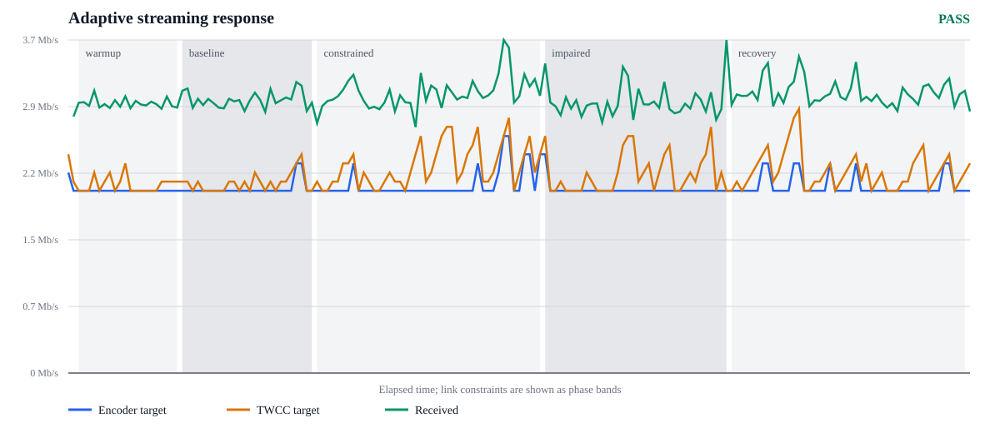

# Adaptive streaming qualification — PASS

Generated at 2026-08-16T13:34:03Z from repository revision `6706cfdf830ded88a718bc35c6b4a94a0a69e089`.

The media controller starts at 5000 kbps and operates from 2000 through 8000 kbps. Its 10% hysteresis keeps a healthy-link target stable once it is close to the configured ceiling.

## Qualification setup timeline

Build time is reported separately from service establishment. The
`connection-started` to `media-connected` interval covers producer startup,
rstream publication, browser startup, signaling, ICE, and first selected media
path; it does not include Docker image builds.

| Milestone | Time since previous milestone |
| --- | ---: |
| runtime-prepared | n/a |
| producer-build-started | 0.1 s |
| producer-build-completed | 1.0 s |
| browser-build-started | 0.1 s |
| browser-build-completed | 0.7 s |
| connection-started | 0.0 s |
| producer-container-started | 0.2 s |
| producer-ready | 1.1 s |
| browser-container-started | 0.0 s |
| media-connected | 8.1 s |

Measured service establishment: 9.5 s.

## Phase summary

| Phase | Samples | Connected | Received kbps (median) | Link use | TWCC kbps (median) | Encoder kbps (median) | Decoded fps | Avg QP | Decode ms/frame | Frozen | NACK | RTX packets | FEC packets | Max RTT ms |
| --- | ---: | ---: | ---: | ---: | ---: | ---: | ---: | ---: | ---: | ---: | ---: | ---: | ---: | ---: |
| warmup | 20 | 100.0% | 2941 | n/a | 2050 | 2000 | 30.0 | 29.8 | 1.45 | 0.0% | 1 | 2 | 4041 | 124 |
| baseline | 26 | 100.0% | 2993 | n/a | 2100 | 2000 | 30.0 | 29.6 | 1.44 | 0.0% | 0 | 0 | 5370 | 173 |
| constrained | 44 | 100.0% | 3044 | 76.1% | 2200 | 2000 | 29.9 | 29.6 | 1.45 | 1.1% | 7 | 11 | 9421 | 425 |
| impaired | 36 | 100.0% | 2947 | 73.7% | 2200 | 2000 | 29.4 | 29.8 | 1.43 | 7.2% | 227 | 183 | 7352 | 332 |
| recovery | 46 | 100.0% | 3044 | n/a | 2150 | 2000 | 30.2 | 29.5 | 1.44 | 0.6% | 14 | 17 | 9853 | 120 |

Congestion response: not required (baseline target fits the constrained media budget). Recovery response: not required.

Selected ICE candidate-pair switches: 0. Both peers remain on the required TURN relay path.

Superseded out-of-order estimator callbacks: 14. The producer always applies the estimator's current target rather than the potentially stale callback payload.

## Congestion-controller diagnostics

| Phase | Loss target kbps | Delay target kbps | Controller loss | Browser TWCC loss | Encoder updates | Update failures | Feedback packets | Padding statuses | Malformed feedback |
| --- | ---: | ---: | ---: | ---: | ---: | ---: | ---: | ---: | ---: |
| warmup | 2055 | 2071 | 0.00% | 0.00% | 0 | 0 | 304 | 0 | 0 |
| baseline | 2070 | 2080 | 0.00% | 0.00% | 2 | 0 | 400 | 0 | 0 |
| constrained | 2234 | 2244 | 0.00% | 0.04% | 14 | 0 | 702 | 4 | 0 |
| impaired | 2161 | 2170 | 2.02% | 2.18% | 1 | 0 | 559 | 293 | 0 |
| recovery | 2149 | 2162 | 0.00% | 0.13% | 12 | 0 | 720 | 12 | 0 |

## Real-time sender queue

The sender drops complete encoded access units before RTP packetization when
its sustained-rate backlog would exceed 225 ms. It schedules a recovery key
frame once the bounded queue has room and resumes on that frame, avoiding
partial-frame corruption, multi-second GOP waits, and bufferbloat. Requests caused by one
congestion event or by repeated receiver PLI/FIR feedback are coalesced to one
encoder request per 250 ms, preventing recovery key frames from becoming their
own burst-amplification loop. A rejected recovery request or packetized RTP
rejection remains a hard failure. A sudden estimator decrease is applied to the
encoder and new media immediately. A frame that was already accepted and
packetized drains at its admission rate: slowing or deleting part of that RTP
frame would create sequence holes and multi-second latency. This bounded
transition is exposed by the actual-residence and scheduled-backlog columns.
Queued FEC and RTX are purged on a rate decrease rather than consuming the new
budget for stale repair. A recovery
key-frame request is deferred until the queue has room for the most recently
observed key-frame size plus 25% headroom, avoiding a request that would produce
another key frame only to discard it. Admission accounts for every queued
primary and FEC service interval, plus the single RTX packet that scheduling may
place before each queued frame. Repair packets older than 225 ms are expired
rather than consuming bandwidth after their media window. Expiration is
reported separately from queue overflow. High-water values are cumulative
process counters, so a later phase retains an earlier peak unless it establishes
a new one; the packet count is sampled within each phase.

| Phase | Any packet residence ms | Primary residence ms | Repair residence ms | Admitted backlog ms | Scheduled backlog ms | Maximum sampled packets | Key-frame reserve bytes | Complete frames dropped | Expired repair packets | Rate-trimmed repair packets | Encoder requests | Coalesced requests | Receiver PLI/FIR | Malformed RTCP | Request failures | RTP queue overflows |
| --- | ---: | ---: | ---: | ---: | ---: | ---: | ---: | ---: | ---: | ---: | ---: | ---: | ---: | ---: | ---: | ---: |
| warmup | 112.8 | 112.8 | 101.3 | 93.0 | 107.7 | 46 | 21048 | 0 | 0 | 88 | 0 | 0 | 0 | 0 | 0 | 0 |
| baseline | 112.8 | 112.8 | 101.3 | 93.0 | 107.7 | 46 | 22283 | 0 | 0 | 87 | 0 | 0 | 0 | 0 | 0 | 0 |
| constrained | 129.2 | 129.2 | 109.9 | 101.7 | 119.3 | 48 | 24162 | 0 | 0 | 73 | 1 | 0 | 0 | 0 | 0 | 0 |
| impaired | 266.5 | 266.5 | 194.5 | 222.9 | 241.0 | 116 | 20862 | 0 | 0 | 155 | 0 | 0 | 0 | 0 | 0 | 0 |
| recovery | 266.5 | 266.5 | 220.6 | 222.9 | 241.0 | 46 | 21674 | 0 | 4 | 73 | 2 | 0 | 0 | 0 | 0 | 0 |

### Repair timeliness

FEC is paced immediately after each protected 4-packet media group so it can
arrive before playout. RTX remains at media-frame boundaries because it repairs
an already reported loss and must not delay completion of the current frame.
The split counters below make a late proactive repair distinguishable from an
expired retransmission.

| Phase | Max FEC residence ms | FEC sent | FEC expired | FEC rate-trimmed | Max RTX residence ms | RTX sent | RTX expired | RTX rate-trimmed |
| --- | ---: | ---: | ---: | ---: | ---: | ---: | ---: | ---: |
| warmup | 101.3 | 0 | 0 | 88 | 67.0 | 2 | 0 | 0 |
| baseline | 101.3 | 0 | 0 | 87 | 67.0 | 0 | 0 | 0 |
| constrained | 109.9 | 0 | 0 | 73 | 72.0 | 15 | 0 | 0 |
| impaired | 160.4 | 0 | 0 | 151 | 194.5 | 234 | 0 | 4 |
| recovery | 160.4 | 0 | 0 | 73 | 220.6 | 26 | 4 | 0 |

## Producer host scheduling

Linux aggregate CPU counters are sampled from the producer's host namespace.
They expose time withheld by the hypervisor separately from work performed by
the application. A run with sustained steal time cannot establish a transport
performance result because the source itself was not scheduled predictably.
The 250 ms sampling heartbeat also exposes shorter pauses that aggregate CPU
counters cannot attribute.
The producer runtime reports 10 logical CPUs.

Source: `linux-proc-stat`.

| Phase | Samples | Median active CPU | p95 steal | Maximum steal | p99 sampler gap | Maximum sampler gap |
| --- | ---: | ---: | ---: | ---: | ---: | ---: |
| warmup | 79 | 8.4% | 0.0% | 0.0% | 258 ms | 258 ms |
| baseline | 101 | 8.5% | 0.0% | 0.0% | 253 ms | 253 ms |
| constrained | 177 | 8.4% | 0.0% | 0.0% | 255 ms | 257 ms |
| impaired | 143 | 8.4% | 0.0% | 0.0% | 255 ms | 257 ms |
| recovery | 180 | 8.4% | 0.0% | 0.0% | 254 ms | 257 ms |

## Receiver host scheduling

Linux aggregate CPU counters are sampled from the receiver's host namespace.
They distinguish media-path latency from time when the hypervisor prevented the
browser host from running. The 250 ms sampling heartbeat also exposes shorter
runtime pauses. The receiver runtime reports 10 logical CPUs.

Source: `linux-proc-stat`.

| Phase | Samples | Median active CPU | p95 steal | Maximum steal | p99 sampler gap | Maximum sampler gap |
| --- | ---: | ---: | ---: | ---: | ---: | ---: |
| warmup | 79 | 8.4% | 0.0% | 0.0% | 255 ms | 255 ms |
| baseline | 101 | 8.5% | 0.0% | 0.0% | 256 ms | 258 ms |
| constrained | 177 | 8.4% | 0.0% | 0.0% | 257 ms | 257 ms |
| impaired | 142 | 8.4% | 0.0% | 0.0% | 255 ms | 257 ms |
| recovery | 179 | 8.4% | 0.0% | 0.0% | 255 ms | 256 ms |

## Encoder cadence and observer effect

The performance result is meaningful only if its source produces frames on
time. Per-frame x264 evidence is written to container-local tmpfs and copied
only after the pipeline stops, not streamed through Docker's logging path; this
prevents detailed diagnostics or host I/O from blocking the encoder being
measured. At 30 fps, a late interval exceeds
50 ms and a catch-up burst is shorter than 16.7 ms. Qualification requires a
p99 gap no higher than 50 ms, no individual gap above 200 ms, and no more
than 1% late or catch-up intervals in any measured phase. The p99 and maximum
columns keep isolated scheduler jitter visible rather than misclassifying it as
network loss or hiding it behind an aggregate frame rate.

| Phase | Measured intervals | p99 frame gap ms | Maximum frame gap ms | Late intervals | Catch-up bursts |
| --- | ---: | ---: | ---: | ---: | ---: |
| warmup | 607 | 38.8 | 43.2 | 0.00% | 0.00% |
| baseline | 764 | 39.0 | 43.7 | 0.00% | 0.00% |
| constrained | 1351 | 38.2 | 41.6 | 0.00% | 0.00% |
| impaired | 1080 | 37.9 | 40.9 | 0.00% | 0.00% |
| recovery | 1300 | 38.1 | 41.5 | 0.00% | 0.00% |

## Network-emulation fidelity

The impairment applies to the selected producer-to-TURN transport. Media, TURN permissions, and TURN channel traffic share that physical branch; rstream publication and HTTP signaling remain outside it.

| Interval | Configured random loss | Shaped packets | Total qdisc drops | Total drop ratio | Ending queue |
| --- | ---: | ---: | ---: | ---: | ---: |
| capacity transitions | 0.00% | 9773 | 0 | 0.00% | n/a |
| constrained steady state | 0.00% | 19835 | 0 | 0.00% | 95/256 (37.1%) |
| impaired (incremental) | 2.00% | 22470 | 463 | 2.02% | 126/256 (49.2%) |
| recovery drain | 0.00% | 757 | 0 | 0.00% | 0/256 (0.0%) |

Total qdisc drops include both configured random loss and queue overflow while the congestion controller reacts. Capacity-transition counters are separated from the final steady interval so a bounded reaction transient cannot hide sustained overload, and steady behavior cannot hide a destructive transition.

## Receiver playout latency

The receiver uses a bounded jitter buffer to absorb packet timing variation and
leave time for repair. Both columns come from cumulative WebRTC receiver
counters. The configured minimum hint is 200 ms. Qualification caps the requested target at 250 ms and the effective buffered delay at 300 ms.

| Phase | Average buffered delay ms/frame | Average target delay ms/frame |
| --- | ---: | ---: |
| warmup | 197.1 | 188.0 |
| baseline | 211.4 | 188.0 |
| constrained | 174.5 | 188.0 |
| impaired | 224.5 | 188.0 |
| recovery | 224.0 | 188.0 |

## Receiver-kernel UDP diagnostics

These independent kernel counters distinguish upstream packet loss from a local
browser socket that could not drain its receive buffer. The qualification
browser is sampled inside its isolated Linux network namespace, so the counters
exclude unrelated host and container traffic.

Source: `linux-network-namespace`.

| Phase | Samples | UDP received | UDP sent | Input errors | No-socket drops | Receive-buffer drops | Send-buffer drops |
| --- | ---: | ---: | ---: | ---: | ---: | ---: | ---: |
| warmup | 20 | 12950 | 461 | 0 | 0 | 0 | 0 |
| baseline | 25 | 16247 | 572 | 0 | 2 | 0 | 0 |
| constrained | 45 | 29616 | 1041 | 0 | 0 | 0 | 0 |
| impaired | 36 | 23268 | 1043 | 0 | 0 | 0 | 0 |
| recovery | 46 | 30310 | 1063 | 0 | 0 | 0 | 0 |

## Producer-kernel UDP diagnostics

These counters come from the producer container's isolated Linux network
namespace. Together with the receiver table they show whether a missing RTP
sequence was dropped by a local socket or disappeared between two healthy
kernel boundaries. Linux may account a `netem` rejection in both the qdisc
drop counter and UDP `SndbufErrors`; therefore send-buffer errors are accepted
only in shaped phases and only up to each interval's independently measured
qdisc drops. Any receive overflow, unshaped-phase send rejection, or excess over
those bounds fails the run.

Source: `linux-docker-network-namespace`.

| Phase | Samples | UDP received | UDP sent | Input errors | No-socket drops | Receive-buffer drops | Send-buffer drops |
| --- | ---: | ---: | ---: | ---: | ---: | ---: | ---: |
| warmup | 20 | 484 | 12983 | 0 | 0 | 0 | 0 |
| baseline | 25 | 600 | 16297 | 0 | 0 | 0 | 0 |
| constrained | 45 | 1095 | 29771 | 0 | 0 | 0 | 0 |
| impaired | 36 | 1091 | 23697 | 0 | 0 | 0 | 0 |
| recovery | 46 | 1117 | 30406 | 0 | 0 | 0 | 0 |

## Acceptance criteria

- PASS — phase-sample-coverage: every measured phase has at least 15 samples
- PASS — producer-host-scheduler: producer host CPU evidence covers every phase, its p95 hypervisor steal time stays at or below 5%, and its 250 ms sampler never stalls for more than 350 ms
- PASS — receiver-host-scheduler: receiver host CPU evidence covers every phase, its p95 hypervisor steal time stays at or below 5%, and its 250 ms sampler never stalls for more than 350 ms
- PASS — playout-target-latency-budget: receiver jitter-buffer target evidence covers every phase and remains at or below 250 ms
- PASS — playout-effective-latency-budget: receiver effective buffered delay evidence covers every phase and remains at or below 300 ms
- PASS — ice-path: every sample uses a TURN relay candidate
- PASS — session-continuity: peer connection and playback remain healthy for at least 98% of samples
- PASS — baseline-throughput: baseline median receive throughput is at least 1 Mbps
- PASS — congestion-response: the baseline encoder target already fits inside the constrained media budget, so no forced reduction is required
- PASS — response-time: no response deadline applies because the baseline target fits the constrained media budget
- PASS — continued-pressure: the encoder does not increase its target after additional loss starts
- PASS — constrained-link-efficiency: median video payload uses at least 55% of constrained link capacity
- PASS — impaired-target-efficiency: median received video remains at least 85% of the encoder target while loss is injected
- PASS — decoder-activity: decoded-frame progress is visible in at least 95% of sample intervals
- PASS — healthy-link-freezes: baseline and recovery spend at most 2% of measured time frozen
- PASS — impaired-link-freezes: each shaped phase spends at most 10% of measured time frozen
- PASS — interactive-latency-budget: maximum RTT stays below 350 ms on unshaped links and 600 ms under the 120 ms one-way impairment
- PASS — decoded-frame-rate: decoded output stays above 25 fps on healthy links and 20 fps while shaped
- PASS — encoder-quality-telemetry: the pinned x264 encoder reports valid per-frame H.264 quantization data in every phase
- PASS — encoder-cadence: the encoded source keeps p99 frame gaps at or below 50 ms, every gap at or below 200 ms, and late or catch-up intervals at or below 1% from baseline through recovery
- PASS — impaired-compression-quality: impaired-link sender average H.264 QP stays at or below 42
- PASS — decoded-resolution: decoded video remains 1920x1080 in every phase
- PASS — recovery-time: no recovery ramp is required because the capacity phase did not require a 20% reduction
- PASS — throughput-recovery: no throughput increase is required when the capacity phase did not reduce the encoder by 20%
- PASS — loss-feedback: network impairment produces NACK feedback
- PASS — rtx-repair: the receiver observes RTX repair packets while loss is injected
- PASS — repair-amplification: NACK feedback remains below 10% of received packets during 2% injected loss
- PASS — flexfec-negotiation: the browser and producer negotiate the FlexFEC-03 protection stream
- PASS — flexfec-repair: the receiver observes FlexFEC packets while loss is injected
- PASS — flexfec-configuration: runtime telemetry matches the FlexFEC protection recorded by the manifest
- PASS — flexfec-shared-pacing-envelope: the sender shares its real-time pacing headroom with proactive repair instead of multiplying both budgets
- PASS — decoded-video: the browser keeps decoding frames throughout the scenario
- PASS — bounded-pacer-capacity: the sender never overflows its packet queue, keeps actual packet residence within 375 ms, and admits no new media beyond 225 ms
- PASS — pacer-recovery-keyframes: every complete-frame admission drop requests a recovery key frame and encounters no encoder rejection
- PASS — rtcp-keyframe-feedback: receiver PLI feedback reaches the producer's encoder instead of being discarded
- PASS — rtcp-feedback-integrity: the producer parses every compound RTCP feedback datagram
- PASS — adaptive-reconfiguration-integrity: the encoder accepts every rate-limited adaptive bitrate reconfiguration
- PASS — twcc-feedback-integrity: TWCC feedback is present and every reported status is parsed without malformed packets
- PASS — selective-media-shaping: the selective traffic-control branch handles the measured media flow
- PASS — capacity-profile-configuration: the capacity phase has no random-loss injector configured
- PASS — loss-profile-configuration: the impaired phase configures exactly 2% random packet loss
- PASS — traffic-control-drop-budget: capacity-step transients stay below 15%, and steady capacity plus random-loss phases stay below 5% drops
- PASS — traffic-control-queue-headroom: the shaped queue ends each steady interval below 75% occupancy, preventing a larger limit from hiding sustained bufferbloat
- PASS — traffic-control-recovery-drain: the healthy recovery profile carries media, adds no drops, and drains every packet before traffic-control teardown
- PASS — twcc-loss-fidelity: browser TWCC loss stays within eight percentage points of shaped-link drops, detecting transport-sequence accounting regressions
- PASS — receiver-udp-observability: receiver-kernel UDP counters cover every measured phase
- PASS — receiver-kernel-capacity: the receiver kernel drops no UDP datagram because its socket buffer is full
- PASS — producer-udp-observability: producer-kernel UDP counters cover every measured phase
- PASS — producer-kernel-capacity: the producer kernel has no UDP receive overflow or send rejection that is not bounded by its independently measured qdisc drops

The checked-in summary is evidence for one pinned run, not a universal performance guarantee. Re-run `./run.sh` on the target architecture before using the result as an acceptance decision.
