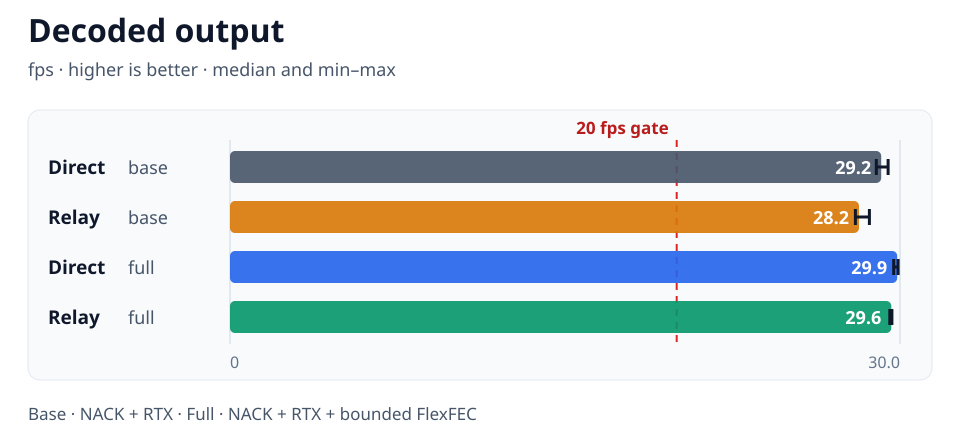
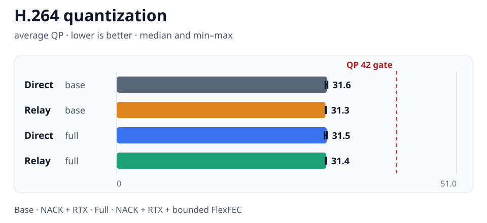
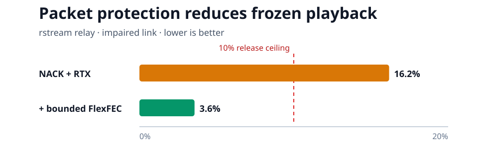

# Adaptive streaming direct/rstream matrix — PASS

Generated at 2026-08-17T02:21:05.440Z from repository revision `ca8a308907aaa5661954af81d10f04bd8e5f52bb`.

## Impaired-link result

Every run applies the same outbound network profile: 4 Mbit/s capacity, 120ms, 30ms, and 2% random packet loss. Direct runs shape the peer media flow on an isolated Docker bridge. Relay runs force both peers through one managed TURN/UDP path and shape the producer-to-TURN transport. HTTP publication and rstream signaling are never shaped.

| Path | Protection | Passed runs | Decoded fps median [min–max] | Avg QP median [min–max] | Frozen median [min–max] | Received kbps median [min–max] | Max RTT ms median [min–max] |
| --- | --- | ---: | ---: | ---: | ---: | ---: | ---: |
| direct | nack-rtx | 2/3 | 29.2 [28.9–29.5] | 31.6 [31.3–31.6] | 4.1% [2.5–5.8%] | 1898 [1888–1908] | 217 [197–232] |
| relay | nack-rtx | 0/3 | 28.2 [28.0–28.6] | 31.3 [31.3–31.4] | 16.2% [12.8–17.0%] | 1899 [1894–1912] | 321 [317–342] |
| direct | nack-rtx-flexfec | 3/3 | 29.9 [29.7–29.9] | 31.5 [31.2–31.5] | 0.6% [0.6–2.4%] | 2428 [2415–2459] | 195 [195–199] |
| relay | nack-rtx-flexfec | 3/3 | 29.6 [29.5–29.6] | 31.4 [31.3–31.4] | 3.6% [2.1–4.3%] | 2460 [2454–2465] | 306 [251–313] |

## Acceptance criteria

- PASS — complete-runs: every matrix run produced a machine-readable summary
- PASS — single-revision: every run qualifies the same repository revision
- PASS — single-producer-tree: every run qualifies the same WebRTC producer source tree
- PASS — clean-producer-tree: the WebRTC producer source tree is clean for every run
- PASS — single-impairment-profile: every run applies the same declared network conditions
- PASS — single-full-protection-profile: every full-profile run uses one explicit FlexFEC protection ratio
- PASS — direct-nack-rtx-coverage: direct-nack-rtx has at least 3 complete run(s)
- PASS — relay-nack-rtx-coverage: relay-nack-rtx has at least 3 complete run(s)
- PASS — direct-nack-rtx-flexfec-coverage: direct-nack-rtx-flexfec has at least 3 complete run(s)
- PASS — relay-nack-rtx-flexfec-coverage: relay-nack-rtx-flexfec has at least 3 complete run(s)
- PASS — full-direct-pass: the full protection profile passes every direct-reference run
- PASS — full-relay-pass: the full protection profile passes every rstream relay run
- PASS — full-direct-adaptation-coverage: every full-profile direct run forces and measures a congestion response
- PASS — full-relay-feedback-coverage: every full-profile relay run receives valid TWCC feedback and avoids increasing its target under additional pressure
- PASS — full-relay-frame-rate: full-profile rstream relay median impaired output stays at or above 20 fps
- PASS — full-relay-freezes: full-profile rstream relay median impaired freeze ratio stays at or below 10%
- PASS — full-profile-quality-coverage: every full-profile direct and relay run reports H.264 quantization quality
- PASS — full-relay-compression-quality: full-profile rstream relay median impaired H.264 QP stays at or below 42
- PASS — relay-direct-frame-gap: rstream relay stays within 5 fps of the direct reference under identical impairment
- PASS — relay-direct-freeze-gap: rstream relay stays within five freeze-percentage points of the direct reference
- PASS — relay-direct-quality-gap: rstream relay average H.264 QP stays within six points of the direct reference
- PASS — proactive-repair-gain: proactive repair materially improves a degraded NACK/RTX relay baseline

The full profile means adaptive TWCC/GCC plus NACK, RTX, and 1 FlexFEC repair packet per 5 media packets. NACK/RTX-only runs remain in the matrix as a diagnostic baseline; the full-profile direct and rstream groups are the release qualification paths.
