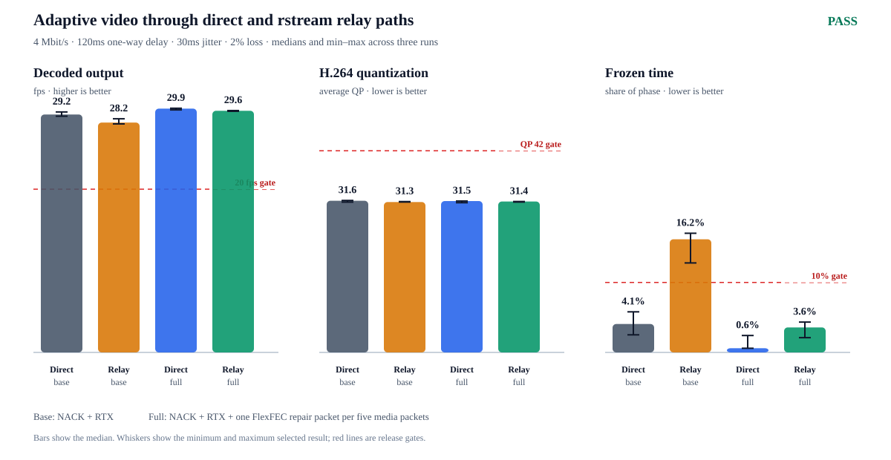
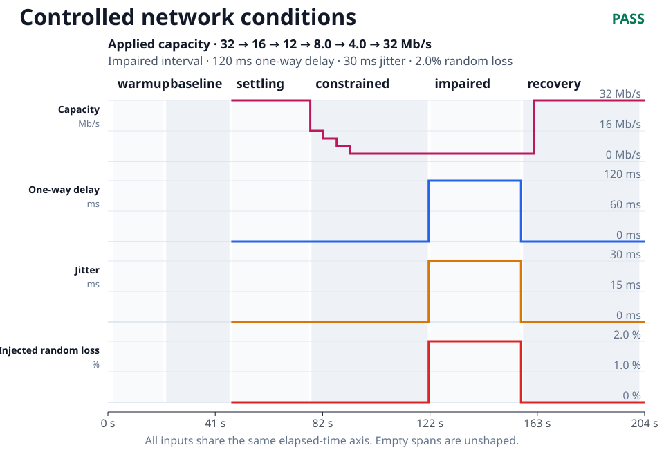
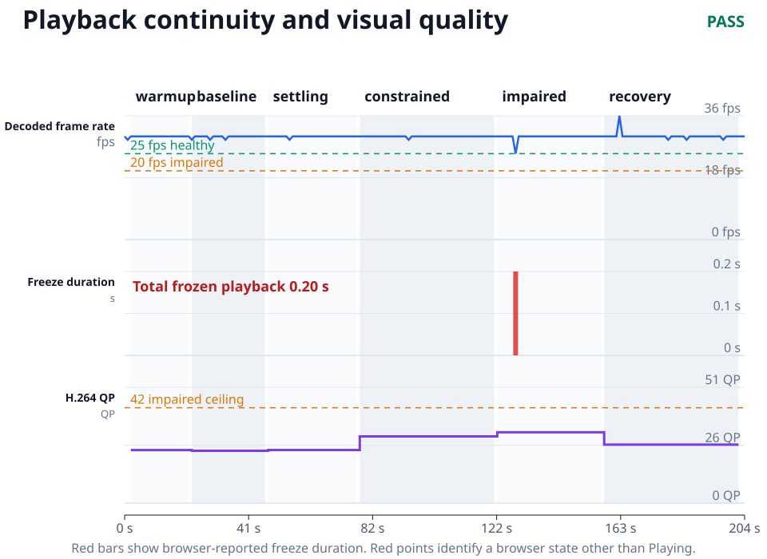
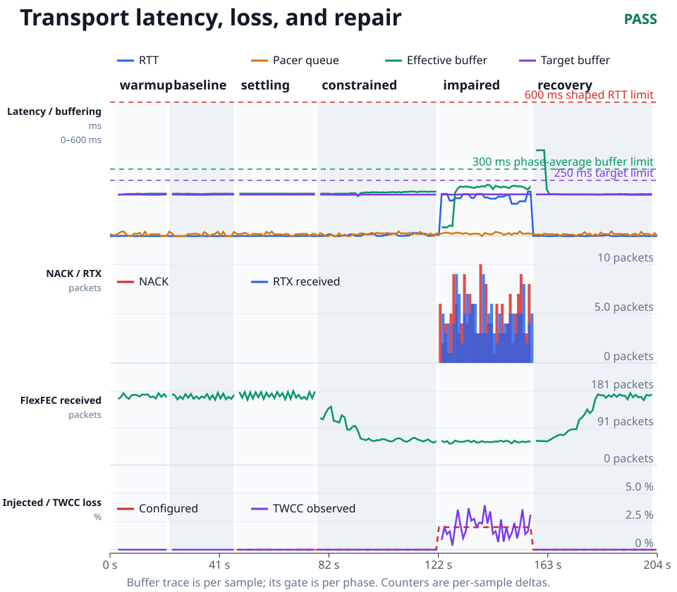

# Adaptive real-time video qualification record

**Decision — PASS.** The NACK/RTX/FlexFEC reference passed three direct and
three forced-rstream-relay runs under the same controlled network profile. The
matrix was recorded from clean media revision
[`ca8a308`](https://github.com/rstreamlabs/rstream-examples/commit/ca8a308907aaa5661954af81d10f04bd8e5f52bb).

This record qualifies the Go producer shared by the standalone and Next.js
video examples. Capture, encoding, congestion control, pacing, repair, recovery,
and producer OpenMetrics are the same implementation in both architectures.
The future MediaMTX path will retain that device-side core and add a second,
separately measured congestion domain between MediaMTX and each viewer.

## Paths under test

The direct reference sends WebRTC media across an isolated Docker bridge. The
relay path forces both peers through managed TURN/UDP and shapes the selected
producer-to-TURN flow. rstream publication and signaling remain outside the
traffic-control branch, so signaling traffic cannot make the media result look
healthier than it is.

Both paths use the same 1920×1080 H.264 source at 30 fps, a 2–8 Mbit/s adaptive
encoder envelope, a 200 ms browser playout hint, TWCC/GCC, NACK, and RTX. The
full profile adds one FlexFEC repair packet per five media packets and budgets
that traffic inside GCC's wire target.

| Phase               | Duration | Applied media path                                           |
| ------------------- | -------: | ------------------------------------------------------------ |
| Warmup              |     20 s | Unshaped                                                     |
| Baseline            |     25 s | Unshaped                                                     |
| Conditioning        |     30 s | 32 Mbit/s, no added delay or loss                            |
| Capacity transition |     45 s | 16, 12, and 8 Mbit/s for 5 s each, then 4 Mbit/s for 30 s    |
| Impaired            |     35 s | 4 Mbit/s, 120 ms one-way delay, 30 ms jitter, 2% random loss |
| Recovery            |     45 s | 4 Mbit/s for 5 s, then 32 Mbit/s for 40 s                    |

Traffic-control transitions are timestamped when the collector observes them.
Every chart uses those measured instants. The sender and browser are sampled
once per second; host scheduling and UDP socket counters are sampled
independently so CPU starvation or local socket loss cannot be mislabeled as a
network effect.

## Acceptance model

The capacity experiment starts only when at least 80% of samples and the final
sample in the preceding ten-second window remain within 10% of that window's
median encoder target. Runs that miss this precondition are retained in
[`rejected-runs.json`](./rejected-runs.json) and excluded before their outcome
is considered.

The release verdict then requires all of the following:

- a reduction of at least 20% within 30 seconds when the stable target exceeds
  the constrained media budget;
- recovery to 80% of that stable target within 35 seconds, at least 80%
  residency over a continuous ten-second window, and receive throughput at
  least 60% of the stable pre-transition rate;
- at least 25 decoded fps on healthy phases and 20 fps while shaped, with no
  resolution change and impaired average H.264 QP at or below 42;
- frozen time at or below 2% on healthy phases and 10% while shaped;
- RTT below 350 ms unshaped and 600 ms under the 120 ms one-way impairment;
- browser target buffering at or below 250 ms, phase-average effective
  buffering at or below 300 ms, packet residence at or below 375 ms, and new
  media admission at or below 225 ms;
- valid TWCC, NACK, RTX, and FlexFEC activity with no pacer overflow, malformed
  feedback, unexplained qdisc loss, UDP socket overflow, or scheduler stall.

The machine-readable summaries retain every individual assertion; this section
states the release envelope rather than replacing it.

## Repeated matrix result

Bars show the median of three selected runs. Whiskers show the complete
selected range, and red lines show the release gates.

| Path   | Protection       | Passed runs | Decoded fps median [min–max] | Avg QP median [min–max] | Frozen median [min–max] | Max RTT ms median [min–max] |
| ------ | ---------------- | ----------: | ---------------------------: | ----------------------: | ----------------------: | --------------------------: |
| Direct | NACK/RTX         |         2/3 |             29.2 [28.9–29.5] |        31.6 [31.3–31.6] |         4.1% [2.5–5.8%] |               217 [197–232] |
| Relay  | NACK/RTX         |         0/3 |             28.2 [28.0–28.6] |        31.3 [31.3–31.4] |      16.2% [12.8–17.0%] |               321 [317–342] |
| Direct | NACK/RTX/FlexFEC |         3/3 |             29.9 [29.7–29.9] |        31.5 [31.2–31.5] |         0.6% [0.6–2.4%] |               195 [195–199] |
| Relay  | NACK/RTX/FlexFEC |         3/3 |             29.6 [29.5–29.6] |        31.4 [31.3–31.4] |         3.6% [2.1–4.3%] |               306 [251–313] |

The NACK/RTX rows are diagnostic baselines, not release candidates. Their
failures remain visible: one direct run missed the constrained-link efficiency
gate, and all three relay runs exceeded the 10% freeze limit. Adding bounded
proactive repair reduced relay median frozen time from 16.2% to 3.6%, a 12.6
percentage-point and 78% relative reduction, while preserving frame rate and
compression quality. The full direct and relay groups passed every run and the
cross-path frame-rate, freeze, and QP limits.

Selected GitHub runs:

- direct NACK/RTX —
  [1](https://github.com/rstreamlabs/rstream-examples/actions/runs/31984432980),
  [2](https://github.com/rstreamlabs/rstream-examples/actions/runs/31984434437),
  [3](https://github.com/rstreamlabs/rstream-examples/actions/runs/31984507667);
- direct full protection —
  [1](https://github.com/rstreamlabs/rstream-examples/actions/runs/31984427675),
  [2](https://github.com/rstreamlabs/rstream-examples/actions/runs/31984429329),
  [3](https://github.com/rstreamlabs/rstream-examples/actions/runs/31984430980);
- relay NACK/RTX —
  [1](https://github.com/rstreamlabs/rstream-examples/actions/runs/31985095453),
  [2](https://github.com/rstreamlabs/rstream-examples/actions/runs/31985760395),
  [3](https://github.com/rstreamlabs/rstream-examples/actions/runs/31986452073);
- relay full protection —
  [1](https://github.com/rstreamlabs/rstream-examples/actions/runs/31984515433),
  [2](https://github.com/rstreamlabs/rstream-examples/actions/runs/31986169442),
  [3](https://github.com/rstreamlabs/rstream-examples/actions/runs/31986790924).

The complete matrix verdict and per-run assertions are available in
[`matrix/comparison.md`](./matrix/comparison.md).

## Synchronized evidence

The representative direct run makes the controller sequence visible against
the independent network input.

The corresponding relay time series use the same axes and gates:

- [network conditions](./relay-reference/network-conditions.svg);
- [adaptive sender response](./relay-reference/adaptive-bitrate.svg);
- [playback continuity and compression quality](./relay-reference/playback-quality.svg);
- [latency, queues, loss, and packet repair](./relay-reference/transport-evidence.svg).

The direct and relay directories also contain their complete one-second
`metrics.csv`, manifest, JSON verdict, and human report.

## Network mobility

The [selected mobility run](https://github.com/rstreamlabs/rstream-examples/actions/runs/31987507811)
moved the running producer to an interface with a different source address.
Trickle ICE published one fresh candidate, ICE restarted once, and the selected
TURN pair changed once. The browser retained one peer connection and one
signaling WebSocket; the WebSocket did not close. Playback's longest measured
interruption was 1.005 seconds.

During the 30-second transition phase, the browser decoded 21.4 fps and
reported 6.6% frozen time. The following conditioning phase returned to 30 fps
with no measured freeze, after which the same session completed the congestion,
loss, repair, and recovery sequence. The complete synchronized record is kept
in [`relay-mobility`](./relay-mobility/).

The immutable GitHub artifact originally failed `loss-guard-response`. Its
one-second series showed a single 98.34% loss interval at the controlled path
switch followed by zero-loss intervals; the original analyzer incorrectly used
the phase aggregate as proof of persistent loss. Analyzer revision
[`b7d2345`](https://github.com/rstreamlabs/rstream-examples/commit/b7d23457262f45b82b879f2a76099c513e0d8753)
requires two consecutive connected intervals above 10%, matching the runtime
guard. Reanalysis of the preserved artifact passes without changing the media
runtime, inputs, or thresholds. The correction is recorded in
[`analyzer-corrections.json`](./analyzer-corrections.json).

## Evidence integrity

Three relay-matrix attempts at media revision `ca8a308` and two later mobility
attempts at analyzer revision `b7d2345` were rejected because their
pre-transition target had not settled. A separate valid mobility attempt passed
the interface switch but failed the sustained recovery gate in the later
congestion sequence. Every run remains linked with its classification and
measured ratio in [`rejected-runs.json`](./rejected-runs.json). No threshold was
relaxed and neither an invalid experiment nor a product failure was replaced
silently.

The qualification runner rejects dirty source trees and records the producer
and browser image digests, runtime architecture, network selector, FlexFEC
ratio, traffic-control schedule, queue limit, and host evidence in every
manifest. The selected matrix uses one source revision, one producer tree, one
browser image, and one impairment profile. The mobility record identifies its
runtime and corrected analyzer revisions separately.

## Reproduce the result

The [qualification runner](../../adaptive-streaming/) documents the isolated
Docker topology, required rstream context, direct and relay selectors, mobility
mode, artifact schema, and matrix command. It preserves failed-run artifacts
before enforcing the verdict, which is why rejected preconditions and product
failures remain distinguishable.
